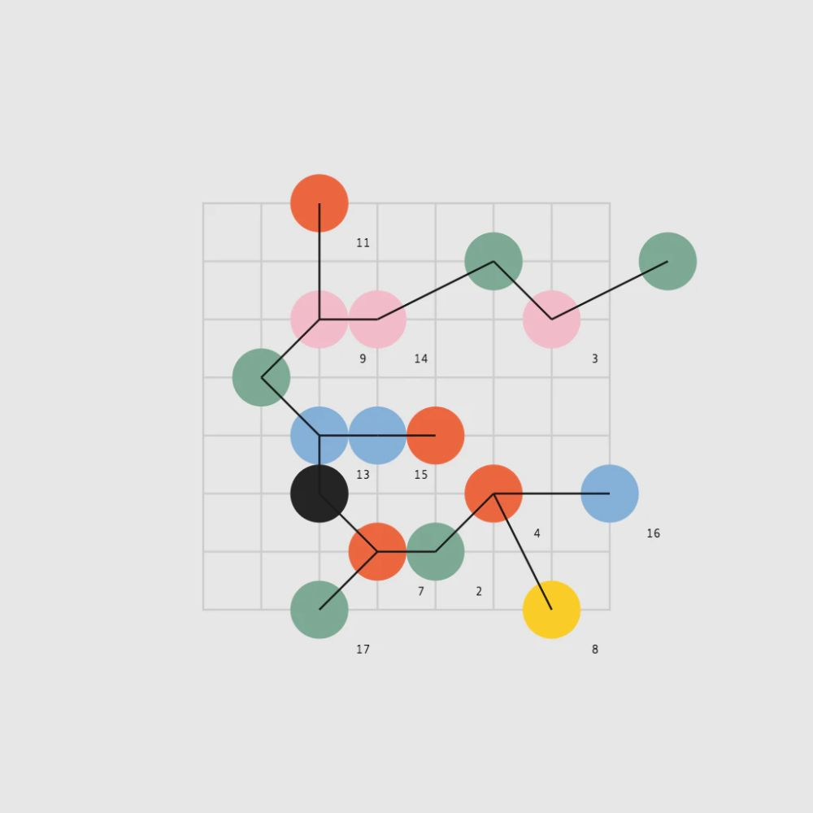
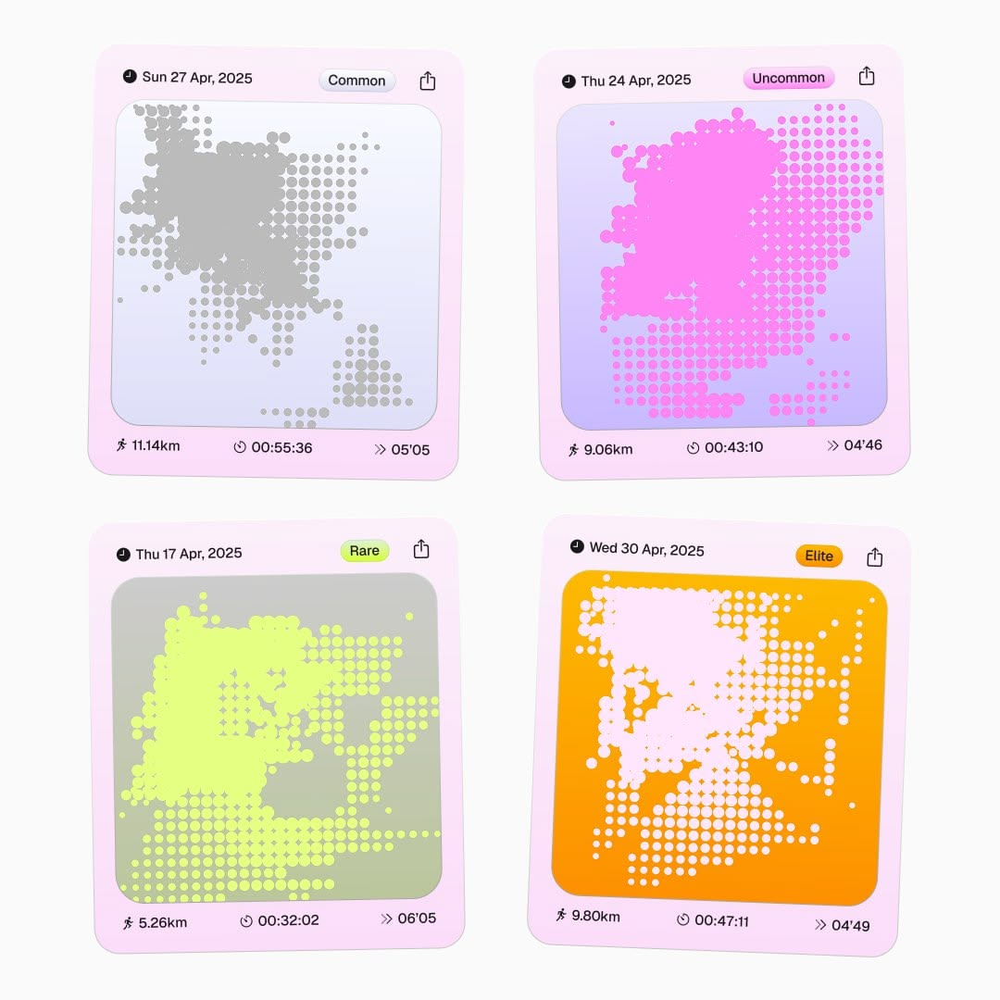
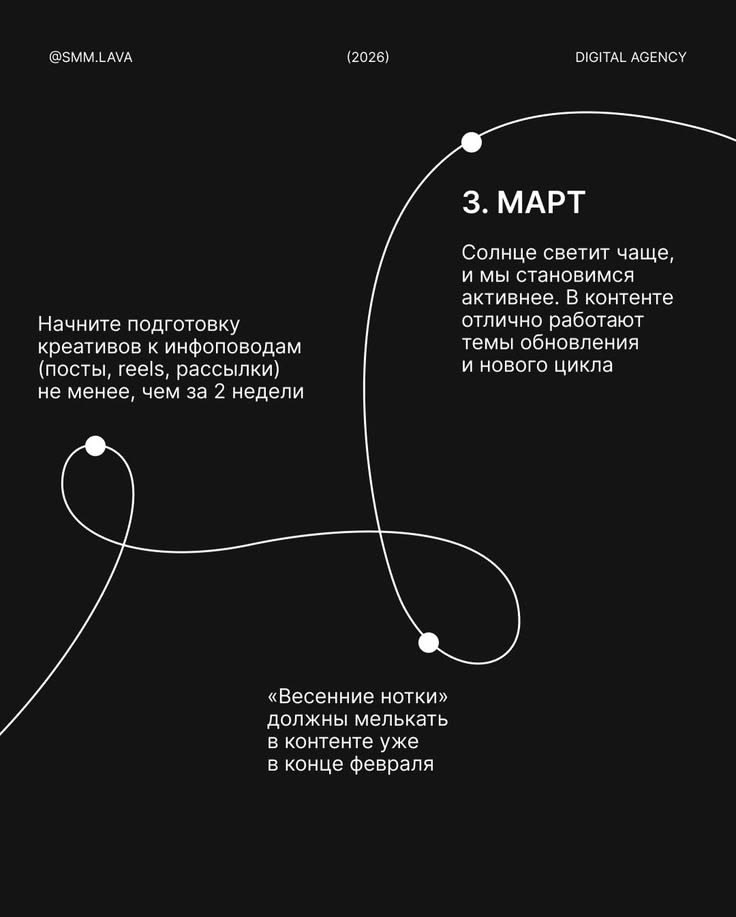
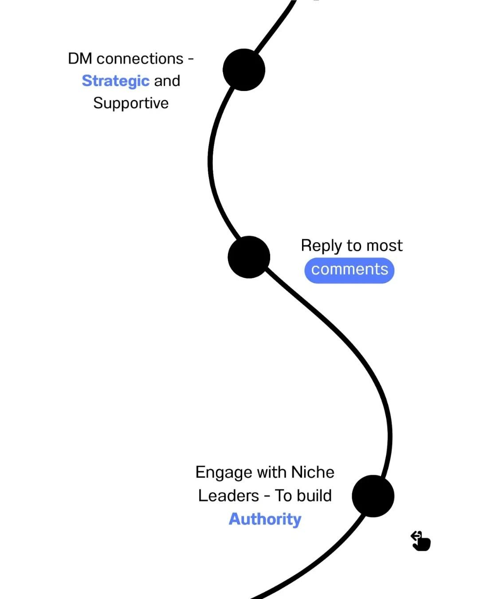
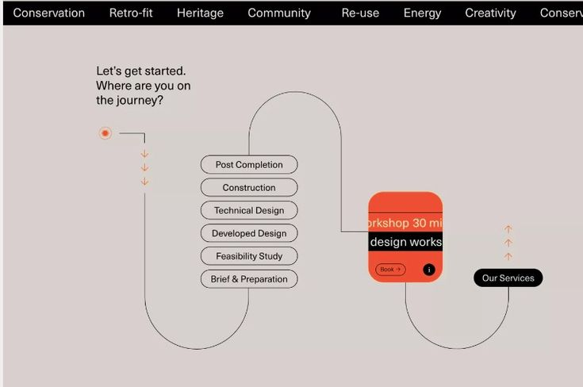
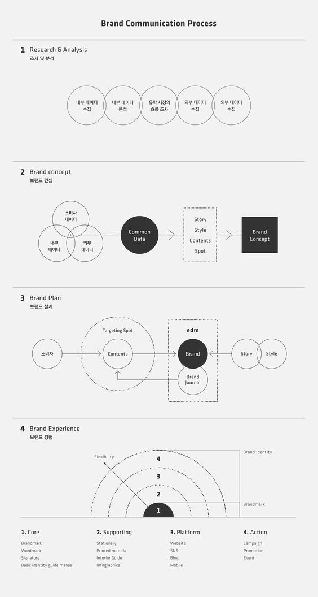
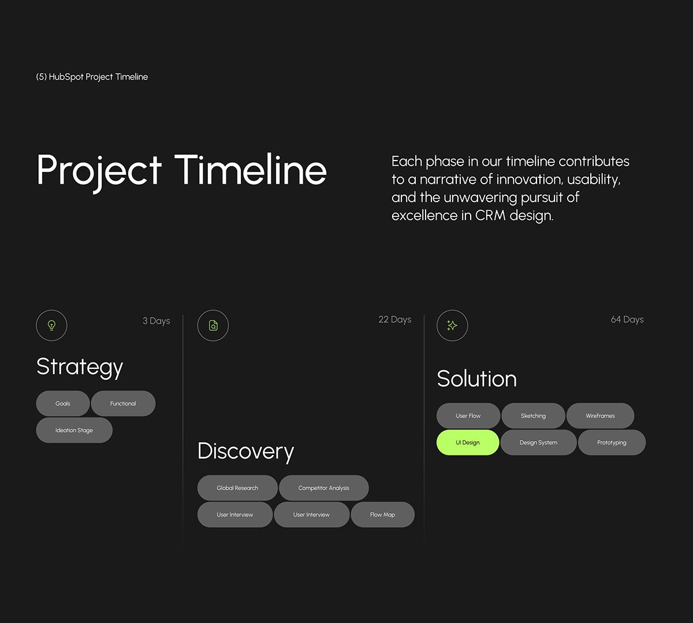

## Summary

A column of rows of cards is a clear way to answer questions and a poor way to see
that ideas connect. Once the card map is standing, every card looks the same
weight, a research finding looks like an assumption looks like a goal, and the
rows read as a list of batches rather than as one piece of thinking that grew.
Give the cards a visual language: a colour family and an icon per kind, one lime
card per screen for the thing that just changed, a research round set apart as its
own territory so what already exists is legible at a glance, and light threads
drawn between a card and the card above it that prompted it — so the map reads as
connected rather than merely stacked.

### The card treatment

Fills doing the work — near-white, grey, and one lime card that is the thing to
look at — with a marker top-left and an icon top-right:

### Colour and connection

Filled colour marks on a faint ground, joined by travelling lines; colour and
density carrying meaning before you read a word:

Long curves that visibly carry the eye from one node to the next — the feeling the
threads between rows are after:

Grouped and enclosed regions — how a research round can read as its own territory:

Icons in outlined circles, chips and a single lime accent on a dark ground —
already close to this product's own system:

## Key Decisions

- **Six colour families for eighteen node kinds.** One hue per kind is eighteen
  hues and no hierarchy at all. Group them: *subject* (the root idea), *question*
  (open-question, unknown, gap), *ground* (user, problem, goal, constraint,
  assumption, known), *found* (research, finding), *judgment* (pro, risk), and
  *forward* (approach, direction, next-step, slice). Six is what the reference
  grids use and what a person can hold without a legend — and `KIND_EYEBROW`
  already names the exact kind on every card for anyone who wants the detail.
- **Status still beats kind. This is the rule that must not break.**
  `nodeShellClasses` documents its precedence — root, then `updated`, then `open`,
  then accent, then answered — and adding kind colour must slot in at the accent
  tier only. An unanswered question is still the unfilled, dashed treatment
  whatever family it belongs to, because "nobody has answered this" outranks "this
  is a question about users". Extend the function's doc comment rather than
  rewriting it.
- **Lime stays reserved for the one thing that just changed.** The design system
  is explicit and the reference agrees — exactly one lime card on screen. None of
  the six families may use lime, which is a real constraint on the palette and the
  reason the *found* family cannot simply inherit today's `lime-deep` accent.
- **Threads, not a connector graph.** The old map drew every parent–child edge
  because the tree was the layout. Here the layout is rows, so a full edge graph
  would be noise crossing the column. Draw one short curve per card, from the
  bottom of the card above that prompted it to the top of this one, in the child's
  family colour — the vertical S-travel of the references, over a few tens of
  pixels rather than the whole plane. A card with no parent in the previous row
  draws nothing.
- **Research is a region, not a swatch.** "Make the competition differentiate from
  the rest" needs more than a colour. A round whose cards are mostly
  research/finding/gap gets its own banded treatment: a tinted ground behind the
  whole row, its own eyebrow — `WHAT ALREADY EXISTS` — and a hairline enclosure,
  the way the grouped-regions reference encloses a cluster. Because a row is
  already a round, this is nearly free, which is a good sign the card-map plan's
  round grouping was the right seam.
- **Icons are inline SVG, one per family, not per kind.** Six glyphs, drawn in the
  manner of `Wordmark` and `SendButton` rather than pulled from an icon package.
  The reference uses emoji in that slot; emoji render inconsistently across
  platforms and would be the only non-drawn mark in the product.
- **Extend the design system doc, do not silently diverge from it.**
  `.codeyam/design/design_system.md` describes the map as a tidy top-down tree
  with dotted `--thread` connectors and node pills. That map is gone as of the
  card-map plan and this plan replaces its visual language. Section 4 has to be
  rewritten or the record and the code disagree, which is worse than having no
  record.

## Implementation

### 1. A family per kind

**File**: `app/lib/mapKinds.ts`

Add `KIND_FAMILY: Record<NodeKind, NodeFamily>` mapping all eighteen kinds onto
the six families, and export the `NodeFamily` union. Keep `ACCENT_KINDS` — it
answers a narrower question (does this kind carry a pro/risk/find accent) and
`nodeShellClasses` still consults it — but the family map becomes the primary
source of a card's colour. Add cases to `app/lib/mapKinds.test.ts` asserting every
kind has a family, which is the test that stops a nineteenth kind shipping
colourless.

### 2. The tokens

**File**: `app/globals.css`

One fill token and one line token per family, beside the existing palette and
exposed through the `@theme inline` block the way every existing token is. Draw
them from the references: the muted orange, sage, dusty blue, soft pink and warm
yellow of the dots-on-grid reference sit naturally on `--paper` and are already in
the same tonal register as `--risk`, `--pro` and `--thread`. Constraint from the
Key Decision: none may be lime.

Fills are light tints rather than saturated — a card is a large area and the
reference's own cards are near-white, grey and one lime. Saturation belongs on the
icon mark and the thread, not on 240px of card.

### 3. Colour and icon on the card

**Files**: `app/lib/nodeAppearance.ts`, `app/components/MapCard.tsx`

`nodeShellClasses` gains the family fill at the accent tier, precedence unchanged,
doc comment extended to name the new tier's source.

**New file**: `app/components/CardIcon.tsx` — six inline SVGs: a question mark, a
magnifier (lift the glyph currently drawn inline in the old pill rather than
redrawing it, if the card-map plan has not already removed it), an arrow, a
plus-minus, a dot, and a filled mark for the root. Sized to the card's top-right
slot, in an outlined circle as in the lime-timeline reference.

In `MapCard`, render the icon in the top-right slot and tint the round marker in
the top-left with the family's line colour, so the card is legible as a category
from across the room and as a sentence up close.

### 4. Threads between the rows

**New file**: `app/lib/cardThreads.ts`

The pure derivation: given the rounds and the nodes, return, for each card, the
id of the card in the previous round that is its parent — or nothing. Unit-tested
for a card whose parent is in the previous round, a card whose parent is further
back (no thread), a card with no parent, and a round with no parents at all.

**New file**: `app/components/RowThreads.tsx`

An absolutely positioned SVG layer spanning the gap between two rows, drawing one
cubic bezier per thread from the parent card's bottom edge to the child card's
top edge, stroked `1.75px` in the child's family line colour at roughly 55%
opacity, with a small filled endpoint dot. Positions come from measuring the card
elements — a `ResizeObserver` on the row plus refs on the cards, redrawn on
resize — because the rows are a CSS flex wrap and there are no computed
coordinates to read.

That measurement is the one genuinely fiddly piece in this plan. If it proves
unstable at execution, the honest fallback is a single centred connector per row
gap rather than per card: it still says the rows are one thread and it needs no
measurement at all. Decide that empirically, not now.

### 5. The research round as its own territory

Edit the row component the prerequisite card-map plan introduces at
`app/components/MapRow.tsx` — it does not exist in the tree yet, which is why this
plan declares that dependency.

When most of a round's cards are `research` / `finding` / `gap`, the row renders
in its banded form: a tinted ground in the *found* family at very low alpha, a
hairline enclosure, and the eyebrow `WHAT ALREADY EXISTS` in place of the round
marker. The threshold and the eyebrow text belong in a small exported helper
beside the row so they are testable and so the rule lives in one place.

### 6. Ground and depth

**File**: `app/globals.css`

A very faint dot-grid background on the map column, as in the dots-on-grid
reference — it is what makes the cards read as placed on something rather than
floating. Add it as a utility class beside `.eyebrow` and `.no-scrollbar`.

Also in that same row component — step earlier rounds back very slightly:
96% opacity on any round that is not one of the two newest. Recession, not
perspective; no 3D transforms, which would break hit targets on the cards' inputs.

### 7. Keep the record honest

**File**: `.codeyam/design/design_system.md`

Rewrite section 4 (*The map*): the card, its anatomy and its shape; the six
families and their tokens; the status-beats-kind precedence stated explicitly,
since it is now carrying more weight than before; the thread; and the research
band. Leave sections 1–3 (colour, typography, shape) intact — the pill radius, the
20px card radius, the type scale and the no-shadows rule all still hold and the
cards are built from them.

## Reused existing code

- `nodeShellClasses` from `app/lib/nodeAppearance.ts` (glossary entry:
  `nodeShellClasses`) — its documented status precedence is exactly what stops
  kind colour from breaking the open and updated treatments; the function is
  extended at one tier and its nine existing unit tests keep their meaning.
- `KIND_EYEBROW` and `ACCENT_KINDS` from `app/lib/mapKinds.ts` (glossary entries:
  `KIND_EYEBROW`, `ACCENT_KINDS`) — the eyebrow already names each kind precisely,
  which is what lets six colour families be enough, and `ACCENT_KINDS` keeps
  serving the pro/risk/find question it was written for.
- The `@theme inline` block in `app/globals.css` — every colour token is already
  exposed to Tailwind through it, so the family tokens follow the same route
  rather than putting arbitrary hex values into class strings.
- `.eyebrow` and `.node-in` in `app/globals.css` — the precedent for adding a
  small, commented, app-wide utility, which the dot-grid ground follows.
- `.codeyam/design/design_system.md` — the record this plan updates rather than
  bypasses; its contrast rules (never `--muted` on `--lime`, never lime as a text
  colour) are binding on the new palette.
- The `find` magnifier SVG currently drawn inline in the map node pill
  (`app/components/MapNodePill.tsx`, which the prerequisite card-map plan removes)
  — lifted into the icon set as the *found* glyph rather than redrawn. Take it
  before that plan deletes the file, or recover it from history.
- `Wordmark` from `app/components/Wordmark.tsx` (glossary entry: `Wordmark`) — the
  established way an icon is drawn in this codebase: hand-written inline SVG with
  `stroke="var(--ink)"` and no dependency.
- **Existing-implementation survey (per-kind colour).** `--risk` `#C4736A`,
  `--pro` `#6B9E84`, `--thread` `#8B8BC8` and `--lime` `#D5F560` already exist with
  meanings assigned by `ACCENT_KINDS` and the design system. The six families
  **reuse** `--risk` and `--pro` for *judgment* and take `--thread`'s violet for
  *question* rather than adding near-duplicates; three genuinely new hues are
  added. No per-kind colour map or icon set exists in the codebase today —
  grepped `app/` for both.
- **Existing-implementation survey (curved edges).** The only edge-drawing code in
  the project is the orthogonal `connectorPath` in `app/lib/mapLayout.ts`, which
  the prerequisite card-map plan retires. There is no bezier or curve helper to
  reuse, so the thread's path builder is genuinely new.
- **Existing-implementation survey (grouping).** `app/lib/summaryGroups.ts` groups
  nodes by kind for the summary screen's cards and returns lists rather than any
  geometry; it is not reusable for the research band, which keys off the round the
  card-map plan derives. Nothing is duplicated.

## Scenarios to Demonstrate

- **A research round** — the banded row with `WHAT ALREADY EXISTS`, distinct at a
  glance from the rounds above and below it. The headline of the plan.
- **A mixed round with one research card** — below the threshold, so no band. The
  boundary case most likely to be got wrong.
- **A round of open questions** — dashed, unfilled cards, proving status still
  beats kind colour.
- **A card that just updated** — the single lime card on screen, unchanged in
  meaning, sitting among six families without competing with them.
- **Threads across three rounds** — each card curving up to the card that prompted
  it, and a card with no parent in the previous round drawing nothing.
- **A round of six cards that wraps to two lines** — the case the thread
  measurement is most likely to get wrong.
- **All six families on one screen** — a map carrying at least one card of each,
  to see whether six reads as a system or as noise.
- **Half screen (760×1000)** — two cards abreast, threads still legible in the
  narrower gaps.
- **Desktop (1440×900)** — four abreast, the same language.
- **`prefers-reduced-motion`** — colour and threads unaffected; only motion is.
- **An empty map** — the dot-grid ground alone, so the ground is confirmed to
  stand on its own rather than needing cards on top of it.