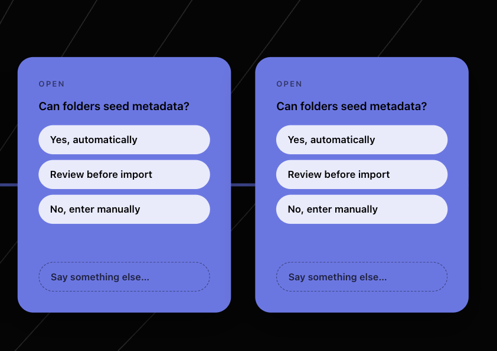

## Summary

Two identical open-question cards appear side by side on the board — same
label, same three options, same everything. The map's own log says only one was
added, and the agent that added it was told the second call was a no-op. The
node writes and the idempotency check are on opposite sides of the same
function: `applyToolCalls` creates every theme and node row FIRST and only then
calls `recordEvents`, which is the only place the `requestId` dedupe lives. A
retried tool call therefore inserts the rows a second time and is then told
"already applied". Move the check in front of the writes, and put both inside
one transaction.



## Root cause

`app/lib/mapStore.ts` — `applyToolCalls` runs, in order:

1. `prisma.theme.create(...)` per new theme,
2. `prisma.mapNode.create(...)` per insert,
3. `prisma.mapNode.updateMany(...)` per update,
4. `prisma.thinkingMap.update(...)` for the phase,
5. and only at the end, `return recordEvents(mapId, events, { requestId })`.

`recordEvents` in `app/lib/exchange.ts` opens its transaction and looks for a
prior row with this `requestId`. On a retry it finds one, returns
`{ deduped: true }` with the original revision, and writes no events — but
steps 1–4 have already run a second time. The board gains a duplicate node
while the event log, the revision counter, and `app/lib/toolRuntime.ts`'s
"Already applied (requestId …)" reply all agree that nothing happened. Nobody
on either side of the exchange can see the duplicate, which is why it reaches
the screen.

The gap is named in the codebase already. The doc comment on `recordEvents` in
`app/lib/exchange.ts` reads: *"`requestId` makes a retry a no-op. An agent that
times out mid-call and retries gets the original revision back rather than a
duplicate node — the failure mode `applyToolCalls` has today."* The dedupe was
built at the event layer and the node writes were never moved behind it.

The existing coverage explains why it survived. `app/lib/exchange.integration.test.ts`
has "treats a repeated requestId as a no-op and returns the original revision",
which passes — it calls `recordEvents` directly and asserts on
`prisma.mapEvent.count`. It never calls `applyToolCalls` and never counts
`prisma.mapNode`. The tested path is not the path the agents take.

**Second defect, same shape.** Steps 1–4 run outside any transaction at all. A
throw partway through the insert loop leaves nodes on the map with no events
and no revision bump — a state no agent reading the log can reconcile, and one
that also renders as an unexplained card. The fix below closes both, because
they are one missing transaction boundary.

## Key Decisions

- **Check the key before writing, not after.** The minimal patch — a
  `findFirst` on `requestId` at the top of `applyToolCalls` with an early
  return — fixes the reported symptom, and is rejected: it leaves two dedupe
  checks racing outside a shared transaction, so two concurrent retries can
  both miss and both insert. The check has to be inside the transaction that
  does the writing.

- **One transaction spanning the whole call.** `applyToolCalls` opens the
  `prisma.$transaction`, does the dedupe lookup as its first statement, and
  performs the theme/node/update/phase writes and the event append on that same
  `tx`. This is what makes "a retry changed nothing" true of the map and not
  only of the log, and it closes the partial-write hole in the same stroke.

- **`recordEvents` keeps its own check and gains an optional transaction
  client.** It is still called directly — by
  `app/api/maps/[id]/exchange/route.ts` among others — so it cannot lose its
  guard. It takes an optional `tx` and uses it when given, so `applyToolCalls`
  does not open a transaction inside a transaction (SQLite will not nest them).
  The dedupe lookup itself moves into a small shared helper in
  `app/lib/exchange.ts` so there is exactly one definition of "have we seen
  this key".

- **The event emit stays outside the transaction.** `mapEvents.emit` currently
  fires after the transaction resolves and must continue to: emitting inside
  would wake waiters on a revision that can still roll back.

- **No schema change, and no content-level dedupe.** Two genuinely different
  calls that happen to add the same question are not this bug and must keep
  working — an agent may legitimately ask a similar question twice. The key is
  the contract; only the key is honoured.

## Reproduction Test

Pins the failure directly: a retried `applyToolCalls` leaves a second copy of
the node on the map even though it reports itself deduplicated.

**Target**: `app/lib/exchange.integration.test.ts` — run with
`codeyam-editor editor refresh-tests --test applyToolCalls`.

The file already has the real-SQLite harness (`beforeAll` pushes the schema to
a temp database), already imports `mapStore`, and already holds the
`recordEvents` dedupe test this one is the missing sibling of. Place the new
test in a `describe('applyToolCalls')` block directly after that one, so the
passing event-level test and the failing node-level test read together.

```ts
// A retry deduplicates the LOG but not the MAP: applyToolCalls creates the
// node rows before it ever reaches the requestId check inside recordEvents,
// so the second call inserts a second identical card and is then told
// nothing happened.
it('does not duplicate nodes when a call is retried with the same requestId', async () => {
  const id = await freshMap();
  const call = [
    {
      name: 'add_nodes',
      input: {
        nodes: [
          {
            ref: 'q1',
            kind: 'open-question',
            label: 'Can folders seed metadata?',
            status: 'open',
            options: ['Yes, automatically', 'Review before import', 'No, enter manually'],
          },
        ],
      },
    },
  ];

  const first = await mapStore.applyToolCalls(id, call, { requestId: 'retry-me' });
  const second = await mapStore.applyToolCalls(id, call, { requestId: 'retry-me' });

  expect(second.deduped).toBe(true);
  expect(second.revision).toBe(first.revision);
  expect(await prisma.mapNode.count({ where: { mapId: id } })).toBe(1);
});
```

Status: PROPOSED — confirm red at execution. Expected failure: the first two
assertions PASS (the log really is deduplicated) and
`expect(await prisma.mapNode.count(...)).toBe(1)` fails with `2`. That split is
the diagnosis restated as a test — the log and the board disagree.

Confirm the `options` field name and the exact `ToolInvocation` shape against
`app/lib/nodePlan.ts` when materializing; `open-question` and `open` are
verified against `NODE_KINDS` and `NODE_STATUSES` in `app/lib/mapKinds.ts`.

## Implementation

### 1. Give the dedupe lookup one home

**File**: `app/lib/exchange.ts`

Lift the "is there a prior batch for this key" query out of `recordEvents` into
a helper that takes a transaction client, a `mapId` and a `requestId`, and
returns the original batch or null. `recordEvents` calls it as its first
statement, exactly as today.

Add an optional transaction client to `recordEvents`' options so a caller
already inside a transaction passes its own `tx` instead of opening a second.
When one is supplied, `recordEvents` skips `prisma.$transaction` and runs its
body on the given client. Keep `mapEvents.emit` where it is — after the
transaction, on a non-deduped result with events.

### 2. Move every write behind the check

**File**: `app/lib/mapStore.ts`

Wrap `applyToolCalls`' body in a single `prisma.$transaction`. As its first
statement, call the new helper; on a hit, return the original batch's
`{ revision, events, deduped: true }` immediately, having written nothing.
Otherwise run the existing theme, insert, update and phase writes on the
transaction's client rather than on the module-level `prisma`, then hand the
same client to `recordEvents`.

The `refToId` / `themeRefToId` resolution, the dangling-ref write-through, the
hue counting, and the event payload construction are all unchanged — this is a
boundary change, not a rewrite of what the function does.

Note for execution: the SQLite transaction now spans the whole call, so give
`$transaction` a timeout generous enough for a large batch, and keep the
`prisma.theme.count` inside it so the hue index cannot be computed against a
count another writer has since changed.

### 3. Say so where the contract is described

**File**: `prisma/schema.prisma`

The `MapEvent.requestId` comment promises "a retried tool call with the same
requestId is a no-op". That is about to become true of the map and not just the
log; update it to say the guarantee covers the rows the call wrote. The
`recordEvents` comment in `app/lib/exchange.ts` that names this as "the failure
mode `applyToolCalls` has today" must be corrected in the same change — leaving
it would document a bug that no longer exists.

## Reused existing code

- `recordEvents` from `app/lib/exchange.ts` — the dedupe this plan moves in
  front of the writes rather than reimplementing.
- `applyToolCalls` from `app/lib/mapStore.ts` — the function being fixed.
- `planMapMutations` and `ToolInvocation` from `app/lib/nodePlan.ts` — the
  call-planning stage, untouched.
- `app/lib/exchange.integration.test.ts` — its temp-SQLite `beforeAll`,
  `freshMap` helper, and `mapStore` import are all reused verbatim by the
  reproduction test.
- `NODE_KINDS` / `NODE_STATUSES` from `app/lib/mapKinds.ts` — the vocabulary the
  fixture uses.
- `add_nodes` in `app/lib/toolRuntime.ts` and its `requestId` passthrough —
  unchanged; its "Already applied" reply simply becomes true.

**Existing-implementation survey.** There is exactly one idempotency mechanism
in the tree — the `requestId` check inside `recordEvents` — and no
content-hash, unique constraint, or second dedupe anywhere. This plan adds no
new mechanism; it relocates the one that exists so the writes happen behind it.

## Scenarios to Demonstrate

- The board after a retried `add_nodes` — one card where there are currently
  two. This is the reported screenshot's state, fixed.
- The board after two genuinely distinct calls that add similar questions —
  both cards still present, proving the fix keys on the requestId and not on
  the content.
- A retried call that spans several nodes and a theme — one theme, one set of
  nodes, the revision unchanged.
- A call with no `requestId` at all — still writes, since idempotency is
  opt-in and the tool description asks agents to supply a key.
- The exchange rail after a retry: no phantom second round.