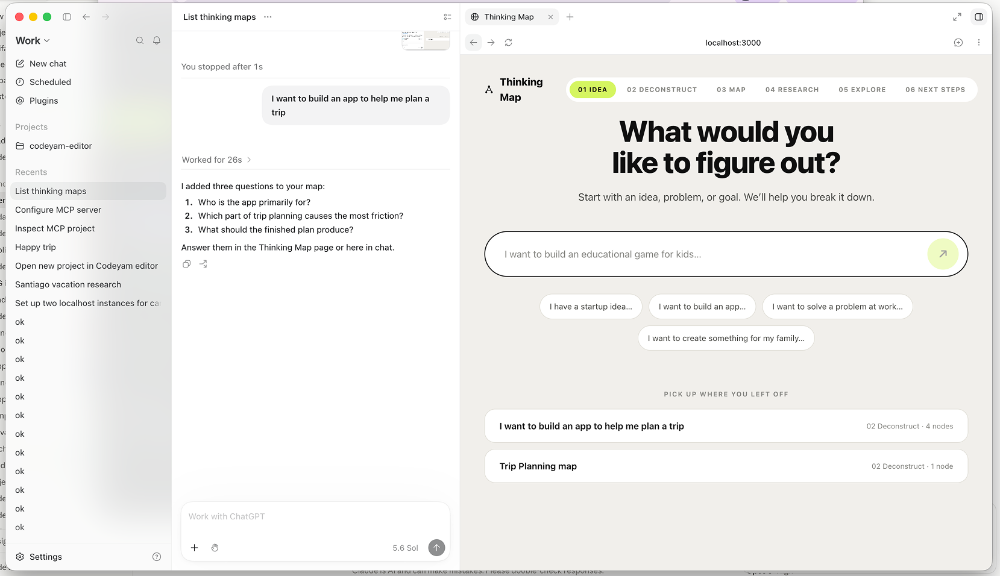
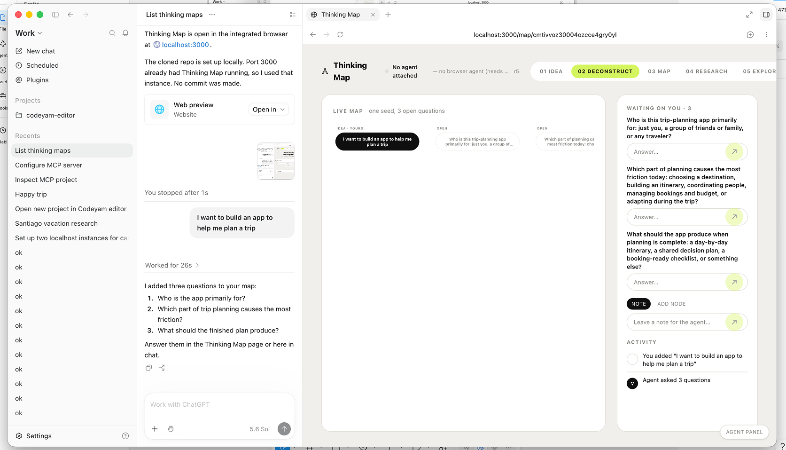

## Summary

The app chrome is sized for a 1440px desktop and breaks at the width it will
actually be seen at. This is going to be driven mostly as an MCP from ChatGPT,
with the page open in the other half of the screen — roughly 700–1000px wide and
tall — and at that width the header falls apart: the wordmark wraps to two lines
("Thinking / Map"), and the six-pill phase track runs straight off the right edge.
Both are visible in the screenshots below: on the landing screen `06 NEXT STEPS`
is clipped at the window boundary, and on the map screen the track stops at
`05 EXPLOR` with the sixth step gone entirely. Underneath that, `px-10 py-8`
spends 80px of horizontal room on padding that the content needs. Make the chrome
fluid: a wordmark that never wraps, a phase track that scrolls horizontally and
keeps the active step in view, a header that stacks when it must, and padding that
steps down with the width.





## Key Decisions

- **Target down to ~640px, degrade below rather than redesign below.** Half of a
  1280–1440px laptop is 640–720px, which is the real floor for "ChatGPT on one
  side, this on the other". One breakpoint at `lg` (1024px) separates today's
  desktop chrome from the fluid chrome; everything under it is the same layout,
  just tighter. Below ~480px the layout still holds (nothing overflows) but is not
  separately designed — a ChatGPT Apps SDK inline widget is not a surface this
  product ships to today, and designing for it now would be speculative.
- **The phase track scrolls; it does not collapse to a progress bar.** The design
  system is explicit that this is a map of the process rather than a progress bar,
  and completed steps are deliberately not distinguished from upcoming ones.
  Replacing it with "3 of 6" at narrow widths would throw that away. A
  horizontally scrollable track that auto-scrolls the active pill into view keeps
  the whole process visible and reachable at any width. A fade mask on the
  trailing edge is what says it scrolls.
- **The wordmark shortens rather than wraps.** `Thinking Map` on one line with the
  glyph, and under ~520px the words drop and the glyph stands alone — a mark that
  wraps mid-name reads as broken in a way a mark alone does not.
- **Add a `Half screen` screen size rather than reusing `Tablet`.** See the survey
  under *Reused existing code*: `Tablet` (768×1024) already exists and is
  dimensionally close, but the scenarios captured at it would be documenting a
  tablet rather than the primary surface this product is used on. A purpose-named
  entry makes the intent legible in the scenario gallery.
- **No change to the fixed-size internals of the map plane.** `ROOT_WIDTH`,
  `measureWidth`, `LEVEL_HEIGHT` in `app/lib/mapLayout.ts` stay exactly as they
  are — the map already scales to its frame through `useFitToFrame`, and how much
  frame it gets is the subject of a separate plan.

## Implementation

### 1. A wordmark that never wraps

**File**: `app/components/Wordmark.tsx`

Add `whitespace-nowrap` and `shrink-0` to the anchor so the mark can never be
squeezed into two lines by a flex sibling. Wrap the `Thinking Map` text in a
`hidden sm:inline` span (Tailwind `sm` = 640px; use an arbitrary
`max-[520px]:hidden` if 640 proves too eager once it is on screen) so the glyph
stands alone at the narrowest sizes. Step the text down from `text-[17px]` to
`text-[15px]` below `lg`. Keep the `suppressHydrationWarning` — the preview proxy
rewrites the `href` and the note in the README explains why.

### 2. A phase track that scrolls, with the active step in view

**File**: `app/components/PhaseNav.tsx`

This becomes a client component (`'use client'`) — it needs a ref and an effect.

- Make the `nav` a scroll container: `flex-nowrap overflow-x-auto` with the
  scrollbar hidden (`scrollbar-width: none` plus `::-webkit-scrollbar { display: none }`
  — add the small utility class to `app/globals.css`, see change 5) and
  `overscroll-x-contain` so a horizontal flick does not chain to the page.
- Hold a ref on the active pill and `scrollIntoView({ inline: 'center', block: 'nearest' })`
  it whenever `active` changes, so advancing a phase brings the new step into view
  without anyone scrolling. Guard for `scrollIntoView` being absent so the jsdom
  render test does not need a polyfill.
- Add a trailing fade so the track reads as scrollable: a
  `mask-image: linear-gradient(to right, black 85%, transparent)` applied only
  under `lg` (the desktop track fits and should not be faded).
- Tighten the pills under `lg`: `px-2.5` instead of `px-3.5`, and drop the
  `tracking-[0.08em]` to `tracking-[0.04em]`. Keep the `01`–`06` numerals; they
  are how the track reads as a sequence.

Add a render test asserting the active pill is scrolled into view when `active`
changes, alongside the existing component tests.

### 3. A header that stacks instead of overflowing

**File**: `app/components/AppHeader.tsx`

Replace the single `flex items-center justify-between gap-8` row with a wrapping
two-part header:

- `flex flex-wrap items-center justify-between gap-x-4 gap-y-2` on the header.
- `min-w-0` on the right-hand group so the phase track can actually shrink — a
  flex item defaults to `min-width: auto`, which is the same trap already
  documented on `ThinkingMapView`'s `min-w-0`.
- Under `lg`, the `{status}` slot moves to its own full-width row beneath the
  wordmark + track (`order-last basis-full lg:order-none lg:basis-auto`), so
  agent presence never competes with the track for the same line.
- Gap steps from `gap-6` to `gap-3` under `lg`.

### 4. Page padding that steps down with the width

**Files**: `app/components/MapScreen.tsx`, `app/page.tsx`

Both `main` elements carry `px-10 py-8`. Change to `px-4 py-4 sm:px-6 lg:px-10
lg:py-8`, and on `MapScreen` step the column gap from `gap-6` to `gap-3 lg:gap-6`.
At 720px this returns 48px of usable width to the content and 32px of height —
which on a half screen is the difference between the map fitting and not.

`app/components/AgentStatus.tsx` also carries a `max-w-[190px]` truncated reason
line; under `lg` hide the reason entirely (the `title` attribute already carries
`UNAVAILABLE_HELP`, so nothing is lost) and keep the dot, the headline, and the
revision.

### 5. The scrollbar-hiding utility

**File**: `app/globals.css`

Add a `.no-scrollbar` utility beside the existing `.eyebrow` and `.node-in`
rules — `scrollbar-width: none` and a `::-webkit-scrollbar { display: none }`
child rule. It goes here rather than inline because the phase track is not the
last place in this app that will want it, and the file already holds exactly this
kind of app-wide, small, commented utility.

### 6. Capture the half screen as a screen size

**File**: `.codeyam/editor.json`

Register the target surface so it is captured rather than asserted:

```bash
codeyam-editor editor configure-screen-size '{"name":"Half screen","width":760,"height":1000}'
```

Then re-register the two whole-page scenarios at both dimensions, so the gallery
carries the half-screen proof next to the desktop one:

- `day-one-nothing-yet` (`app/page.tsx`) — `"dimensions": ["Desktop", "Half screen"]`
- `mid-exchange-agent-and-human-on-one-map` (`app/map/[id]/page.tsx`) — same

The remaining 160-odd component scenarios stay Desktop-only; they render one
component in isolation and gain nothing from a second viewport.

### 7. Say what surface this is for

**File**: `README.md`

The README documents the three front doors in detail but never says what shape of
window the page is meant to be read in. Add two sentences to the section
describing the page-side exchange: the page is designed to sit beside the agent
that drives it — most often as half a screen next to ChatGPT — and the chrome is
built to hold from about 640px up.

## Reused existing code

- `PHASES` / `PHASE_LABELS` from `app/lib/mapKinds.ts` (glossary entries: `PHASES`,
  `PHASE_LABELS`) — the track keeps reading its content from the same source; only
  its container changes.
- `AppHeader` from `app/components/AppHeader.tsx` (glossary entry: `AppHeader`) —
  already the one header shared by the landing and map screens, so fixing it once
  fixes both. Its `status` slot is the seam the stacking rule uses.
- `AgentStatusDot` from `app/components/AgentStatusDot.tsx` (glossary entry:
  `AgentStatusDot`) — survives unchanged; only the prose beside it is hidden at
  narrow widths.
- `.eyebrow` and `.node-in` in `app/globals.css` — the precedent for adding a
  small documented utility class app-wide rather than repeating the declarations.
- `min-w-0` reasoning already written out at `app/components/ThinkingMapView.tsx:161`
  — the same flex trap, applied to the header's right-hand group.
- **Existing-implementation survey (screen sizes).** The `screenSizes` map in
  `.codeyam/editor.json` already holds `Mobile` 390×844, `Desktop` 1440×900, `Tablet` 768×1024, and
  `Laptop` 1280×800. `Tablet` is dimensionally within 8px of the proposed half
  screen, so nothing new is technically required; the entry is added for naming,
  not capability, and that trade is the Key Decision above. Every one of the 166
  registered scenarios currently declares `["Desktop"]` and nothing else, so no
  existing scenario changes meaning.
- **Existing-implementation survey (responsive breakpoints).** Grepped the whole of
  `app/` for `sm:` / `md:` / `lg:` / `@media` outside the stylesheet: there are
  none. This app has no responsive system today beyond `SummaryView`'s single
  `lg:grid-cols-3`. Nothing is being duplicated — this plan introduces the first
  one, which is why the breakpoint choice is stated as a decision rather than
  inherited.

## Reproduction Test

The phase track and the wordmark overflow their container below about 1100px.

**Target**: no unit-level reproduction. Both failures are pure layout — an element
wider than its container, and a flex child wrapping — and jsdom has no layout
engine, so `getBoundingClientRect` returns zeros and an assertion about overflow
would pass whether or not the bug is present. A test asserting the presence of
`overflow-x-auto` would be testing the fix rather than the defect.

Demonstrate it instead with the two whole-page scenarios re-registered at the new
`Half screen` dimension in change 6 — `day-one-nothing-yet` and
`mid-exchange-agent-and-human-on-one-map`. The before/after captures at 760px are
the evidence, and they are the same two screenshots attached to this plan.

One genuinely testable behavior does ship with the fix and should get a test of
its own (not a reproduction): `PhaseNav` scrolls the active pill into view when
`active` changes. Add it to the component's render tests with a stubbed
`Element.prototype.scrollIntoView`.

Status: PROPOSED — no red to confirm; visual regression demonstrated by scenario
capture.

## Scenarios to Demonstrate

- **Landing at half screen (760×1000)** — day one, no saved maps: wordmark on one
  line, all six phase pills reachable, `01 IDEA` in view.
- **Map screen at half screen (760×1000)** — mid-exchange, three open questions,
  `02 DECONSTRUCT` active and scrolled into view, agent status on its own row.
- **Map screen at half screen, last phase active** — `06 NEXT STEPS` active, so
  the track is scrolled to its far end and the leading fade is what shows there is
  more to the left.
- **Landing at 480px** — narrower than the design target: the glyph stands alone
  with no wordmark text, nothing overflows horizontally.
- **Both screens at Desktop 1440×900** — unchanged from today. The `lg` breakpoint
  means the existing desktop chrome is exactly what it was, which is the thing
  most at risk of quietly regressing.
- **Map screen with no agent attached** — the truncated `— no browser agent…`
  reason is hidden under `lg` while the dot and headline remain, and the `title`
  still carries the full explanation.