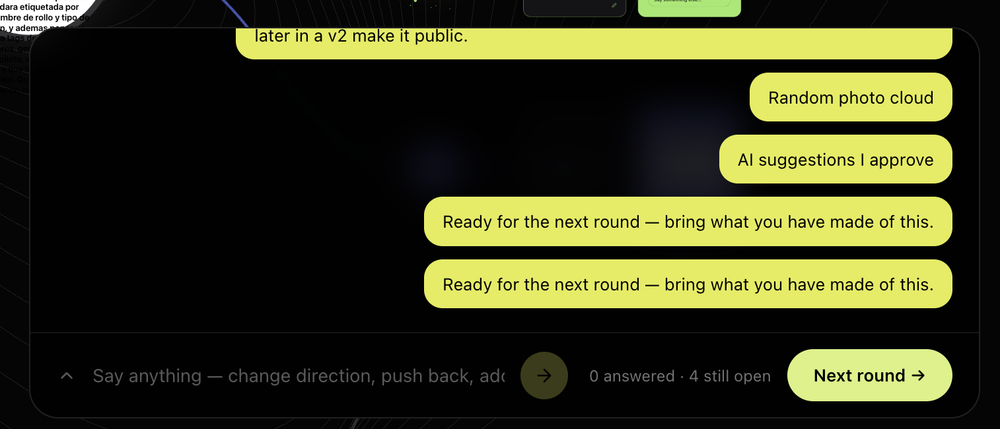
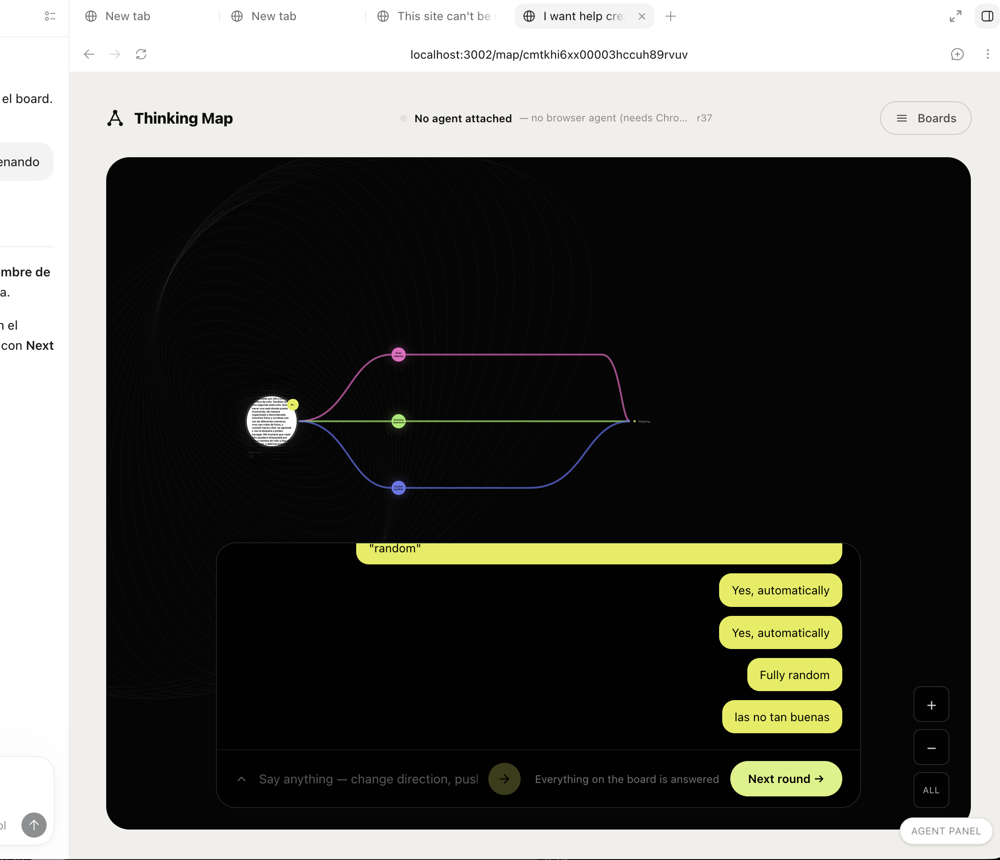

## Summary

Everything the board puts on screen piles up along its bottom edge and covers
the map it is about. The conversation panel is 720px wide, centred, and grows a
tall stack of identical lime bubbles; the zoom controls sit in the opposite
bottom corner it is about to move into; and an answer to a specific card looks
exactly like a general remark, so the transcript reads as one undifferentiated
column. Move the conversation to a small panel in the bottom-right that can be
collapsed and closed, move the zoom controls to the bottom-left so the two stop
competing, and colour each answer with the card it answered — which is also
what finally makes "answering a card" and "saying something general" look like
the two different things they already are.

## What already exists — do not rebuild it

- **The general chat is already there and already general.** `BoardChat`'s
  input calls `onSay` in `app/components/BoardWorkspace.tsx`, which contributes
  a `user.note` — its own comment reads *"A note, like a choice: nothing on the
  map is being closed. This is the slot for everything the partner did not
  think to ask about."* `BoardChat`'s header comment says the same: what you
  type "applies to all of it rather than to whichever card is nearest." The
  capability is complete. What is missing is that nothing on screen SAYS so —
  the placeholder is a sentence, not a label. This plan adds the affordance,
  not the feature.
- **Collapsing is already there.** `BoardChat` holds an `open` state and a
  chevron that toggles the transcript. What is missing is closing it outright
  and getting it back, and having that survive a re-render.
- **One place already decides what a theme looks like.** `themeColor(hue, …)`
  in `app/lib/themeHue.ts` exists precisely "so a card, its connector and its
  cluster label cannot drift apart". A bubble is the fourth thing that must not
  drift, and it should call the same function rather than grow its own palette.

## Key Decisions

- **An answer is coloured by the card it answered; a general note is not.**
  This is the whole rule, and it does double duty. `user.answer` payloads carry
  `answers: [{ id, text, answer }]` where `id` is the node id, so the bubble can
  be traced to its node, to its theme, to its hue. `user.note` has no node —
  correctly, because it is about the whole map — so it stays neutral. The
  colour is therefore not decoration: it is the visible difference between
  answering something specific and saying something general, which is exactly
  the distinction this plan was asked to make legible.

- **Colour comes from `themeColor`, never a new hex.** The bubbles currently
  hardcode `#e4ec4b` inline — not even the `--lime` token. Replacing one
  hardcoded hex with several would be the same mistake at greater cost.
  `themeColor(hue, lightness, saturation)` already has the lightness/saturation
  seam this needs to keep dark-panel text readable.

- **A node whose theme cannot be resolved falls back to neutral, silently.** An
  answer to a node since deleted, or one on a map with no themes, must render
  as an ordinary bubble rather than as an error or a default colour that lies
  about which theme it belongs to.

- **Bottom-right for the conversation, bottom-left for zoom.** They are moving
  for one reason — they were about to be in the same corner — which is why this
  is one plan rather than two. The zoom controls are already marked `data-no-pan`
  and positioned against the viewport rather than the board plane; only the side
  changes.

- **Three states, not two: open, collapsed, closed.** Collapsed keeps the input
  row with the transcript hidden — what the chevron does today. Closed leaves
  only a small reopen affordance, so the board is genuinely uncovered. The
  input row is what "the chat is always here" means, so closed must still be one
  click from typing.

- **The beige frame is an invariant this plan must not break, not a bug it
  fixes.** `MapScreen`'s `main` is `h-screen … px-10 py-8` on the paper
  background, and `BoardWorkspace`'s root is
  `overflow-hidden rounded-[26px] border border-white/10`. Together those
  already guarantee that the board's zoom transform is clipped inside the black
  and the beige border survives — the plane is transformed inside a clipping
  parent, so it cannot escape. No frame-escape was reproducible while planning.
  It is written here as a constraint and given its own scenario so that moving
  the chrome cannot quietly break it.

- **The remaining lime in this panel is out of scope pending a separate
  decision.** The send button and the "Next round" control are lime, and a
  broader "lose the lime for black" direction is open. Answer bubbles are
  settled here because they become theme-coloured either way; the rest of the
  panel's palette should not be churned twice.

## Implementation

### 1. Give an answer its card's colour

**File**: `app/components/BoardChat.tsx`

`line()` currently reduces every event to `{ who, text }`, discarding the node
ids in a `user.answer` payload. Widen its return with an optional node id, and
let the component resolve id → node → `themeId` → hue → `themeColor(...)`.
Replace the inline `background: '#e4ec4b'` with that colour, keeping the
neutral treatment for `who === 'partner'` and for any `you` line with no
resolvable node.

`BoardChat` does not currently receive the nodes. Pass them from
`BoardWorkspace`, which already holds `themes` and `nodes` — a lookup map built
once, not a per-bubble scan.

Note for execution: a `user.answer` can carry several answers and is currently
joined into ONE bubble with ` · `. Answers to different cards would then want
two colours in one bubble. Splitting one event into one bubble per answer is
the cleaner result and changes what the transcript looks like — confirm against
the capture before committing to it.

### 2. Shrink it and move it to the corner

**File**: `app/components/BoardChat.tsx`

The root is `absolute bottom-6 left-1/2 z-30 w-[min(720px,90%)] -translate-x-1/2`.
Move it to the bottom-right and make it substantially narrower — the transcript
is short bubbles, not prose, and its job is to stay out of the way. Keep
`data-no-pan`, keep the `pointer-events-auto`, and keep the scroller pinned to
the newest line.

The bubbles are `justify-end` for you and `justify-start` for the partner
inside a 720px panel. In a narrow panel that distinction has much less room —
check that a partner line still reads as theirs, since the colour rule now
carries meaning the alignment used to carry alone.

### 3. Let it be closed, and say what it is

**File**: `app/components/BoardChat.tsx`

Add a closed state beside the existing `open`, with a reopen affordance that
survives closing. Label the input as the general channel — a short "Chat" (or
similar) heading on the input row — so the thing the code already documents as
"everything the partner did not think to ask about" says so on screen. Keep the
placeholder; the label answers a different question than the placeholder does.

### 4. Move the zoom controls

**File**: `app/components/GalaxyBoard.tsx`

The `+` / `−` / `All` stack is `absolute bottom-6 right-6 flex flex-col gap-2`.
Move it to the bottom-left. Nothing else about it changes — it stays fixed to
the viewport rather than the board plane, and keeps `data-no-pan` so dragging
on it does not pan the board.

### 5. Hold the frame

**File**: `app/components/BoardWorkspace.tsx`

No change expected — the root's `overflow-hidden rounded-[26px]` is what keeps
the zoomed plane inside the black and the beige border intact. It is listed
here so the constraint is checked rather than assumed: after the moves above,
confirm the board still clips at the rounded edge at both extremes of zoom and
that `MapScreen`'s `px-10 py-8` paper margin is unbroken.

## Reused existing code

- `themeColor` and `hueForIndex` from `app/lib/themeHue.ts` (glossary entry:
  `themeColor`) — the single source of a theme's appearance.
- `BoardChat` from `app/components/BoardChat.tsx` (glossary entry: `BoardChat`)
  — its `line()` reducer, its `open` state, its scroll-pinning effect and its
  `data-no-pan` are all kept.
- `BoardWorkspace` from `app/components/BoardWorkspace.tsx` — already holds
  `themes` and `nodes` and already owns `onSay`; it gains no new state.
- `GalaxyBoard` from `app/components/GalaxyBoard.tsx` (glossary entry:
  `GalaxyBoard`) — only the control stack's corner changes.
- `MapScreen` from `app/components/MapScreen.tsx` — the paper margin that makes
  the beige frame; unchanged and asserted.
- `ExchangeEvent` from `app/lib/exchange.ts` — the answer-kind and note-kind
  payload shapes the colour rule keys off.
- `RoundControl` from `app/components/RoundControl.tsx` — rides in `trailing`
  and must keep fitting once the panel is narrower.

**Existing-implementation survey.** The general-chat channel, the collapse
toggle, and the theme-colour helper all exist and are reused rather than
rebuilt — see the section above. What does not exist: any link from a bubble
back to the node it answered, any closed state, any label on the input, and any
persistence of the panel's open/closed state.

## Scenarios to Demonstrate

- A transcript mixing answers to three differently-themed cards with a general
  note — three hues and one neutral bubble, which is the whole rule in one
  picture.
- The same transcript collapsed: input row only, board visible.
- Closed: the board uncovered, with the reopen affordance the only thing left.
- An answer to a card whose theme is gone — neutral, not broken.
- A long answer in the narrow panel, wrapping rather than overflowing.
- The board at maximum zoom with the beige frame intact — the invariant, made
  visible.
- The bottom-left zoom stack and the bottom-right conversation on one screen,
  not touching.
- A narrow viewport, where the panel and the zoom controls have the least room
  to coexist.