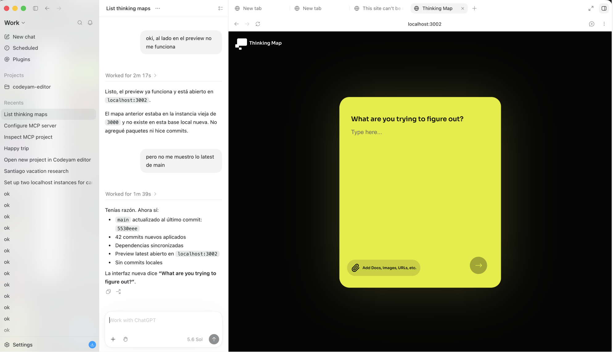
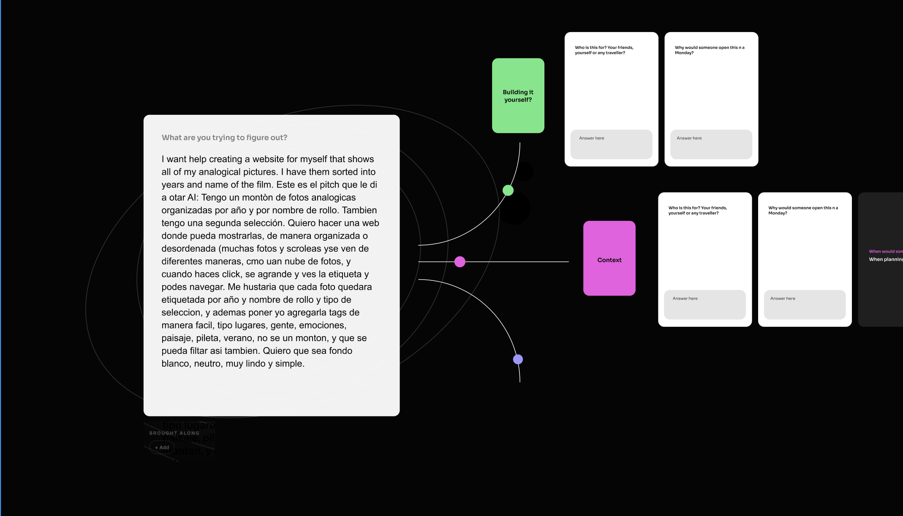
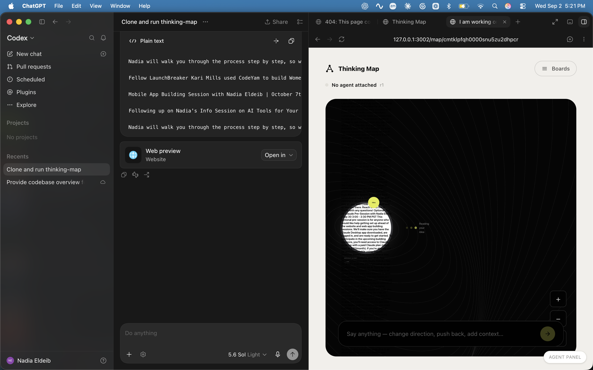

## Summary

The idea a person types is the one thing on this product that is entirely
theirs, and right now it is hard to read at both ends of its life. On the
landing screen the first card centres its question and centres what you type,
so a sentence drifts sideways as you write it and reads at a size the rest of
the board would never use for body copy. Then you press send and that same
sentence is crammed into a 500px white disc that shrinks the type to fit and,
past a few hundred words, simply overflows the circle onto the black board —
the state in the "not this" screenshot below, where the idea is unreadable at
any zoom. This plan makes the idea read at both ends: the first card
left-aligns and steps up in size, and the core stops being a disc that
squeezes text and becomes a paper card that grows to hold it, with the card's
own question carried over as its label. A bottom-right collision between the
agent panel and the conversation is fixed along the way.

Reference images, all supplied with the request:

- 
- 
- 

These are three changes to one object seen at two moments, plus one rider, and
they are deliberately in one plan at the requester's instruction rather than
split the way the grouping rule would normally split them.

## Key Decisions

- **The first card and the core are the same object, so they get the same
  treatment.** `QuestionCard` and today's `CoreIdeaCard` text are already
  `text-left`; the first card is the only surface in the product that centres
  its copy. Making it left-aligned is not a preference, it is the card
  agreeing with what it is about to become.
- **Contents left, card centred.** Only the `text-center` classes on the first
  card's *contents* change. The wrapper that floats the card in the middle of
  the black screen is untouched, and so is the vertical centring of the typing
  area inside a deliberately empty card.
- **The core grows instead of the type shrinking.** Today the rule is the
  reverse and it is stated explicitly in the code: "Long ideas get smaller type
  rather than a bigger circle: the circle's size is what marks it as the
  centre." That rule is what produces the unreadable state. The new rule is
  that the type has a readable floor and the card grows downward to hold what
  it must.
- **The core's WIDTH stays at `2 × CORE_RADIUS`; only its height changes.**
  This is what keeps the change cheap. `fanPath(CORE_SIZE.radius, …)` starts
  every connector at the core's horizontal edge, and `layOutGalaxy` builds its
  bounds from the same radius, so a fixed width means every horizontal
  relationship on the board — hub distance, fan curves, frame-all's left and
  right — is untouched.
- **A rounded rectangle, not a disc — and the eyebrow takes over the disc's
  job.** The circle exists so that "the thing that is not a card is the thing
  everything else is about", which is a real argument and the reason to
  replace it rather than just stretch it: the core is still the only PAPER
  object on a board of white and coloured cards, and it now carries the
  question "What are you trying to figure out?" as a label above the words,
  which says what it is more plainly than a shape ever did.
- **The orbiting "Idea" badge goes with the circle.** It travels a circular
  path of radius `CORE_RADIUS`, which on a card taller than it is wide would
  cut straight through the card's own edges. The reference image has no badge,
  and the eyebrow now does the labelling. The alternative — parking the badge
  at a corner — is worth raising at the Confirm gate if the loss of the one
  moving thing on the board is felt.
- **The bottom-right overlap named in the request is partly already fixed.**
  The screenshot shows the chat composer sitting on top of the zoom stack; that
  exact collision was resolved by `59bad53`, which moved the zoom controls to
  the bottom-left, and the screenshot predates it. What is still in that corner
  is the agent panel. It is included here as a small rider rather than as its
  own plan, at the requester's instruction.
- **Sizes below are starting points to confirm on screen, not measurements.**
  The reference images come from a different implementation whose card
  geometry does not match this board's, so treating their pixel sizes as
  specifications would be false precision. Every number below is a proposal to
  look at and adjust in the preview.

## Implementation

### 1. Left-align the first card's contents

**File**: `app/components/FirstCard.tsx`

Three `text-center` classes come off. The heading `
` (line 119) and the
error `
` (line 194) simply lose theirs — left is the default. The
`<textarea>` (line 140) gets an explicit `text-left` instead, because a
textarea reads its alignment from inherited CSS and an explicit class is what
keeps the field from following whatever a future ancestor sets. The
`placeholder:text-black/40` styling follows the same alignment automatically,
so "Type here…" lands on the left too, under the question.

This is the change that matters most in use: today the sentence recentres
itself on every keystroke, so the words you already typed move while you are
still typing.

### 2. Make the first card's type bigger

**File**: `app/components/FirstCard.tsx`

The question is `text-[19px]` and the typing area `text-[17px]` — body sizes,
on a card that holds exactly one sentence and has room to spare. Step the
question up to roughly `24px` and the typing area to roughly `19px`, keeping
the question the heavier of the two. Check the result against the wrapped
question at the card's narrow end (`max-w-[88vw]`): the heading must still fit
in two lines at a phone width rather than three.

Leave the card's own `w-[440px]` and `minHeight: 520` alone unless the larger
type visibly crowds them, in which case widening the card is preferable to
walking the type back — the ask is legibility.

### 3. Explicitly out of scope on the first card

**File**: `app/components/FirstCard.tsx`

The outer wrapper (line 110, `flex flex-1 flex-col items-center
justify-center`) and the field's vertical centring (line 126, `flex flex-1
items-center`) both stay exactly as they are. Both are position, not
alignment. Noted here so the change is not read as "un-centre the card".

### 4. Turn the core from a disc into a paper card

**File**: `app/components/CoreIdeaCard.tsx`

The substantive change. Today the core is a `rounded-full` white disc of fixed
`CORE_RADIUS * 2` in both dimensions, with an 18px ring, holding a single `
`
whose font size steps down at 60 and 120 characters. Past a few hundred
characters the text runs out of the circle entirely.

Replace it with a rounded rectangle, still centred on the board's origin:

- **Width fixed at `CORE_RADIUS * 2`**, height driven by content — see the
  decision above for why the width must not move.
- **Fill `--paper` (`#f1efea`), text `--ink`** — the tokens already defined in
  `app/globals.css`. This is the product's own paper, and it makes the core the
  only paper object on a board whose other cards are white and coloured. Drop
  the heavy `#333336` ring, which existed to stop a white disc dissolving into
  its own glow; a large paper rectangle on black does not need it. Keep a soft
  shadow if the edge reads as cut out.
- **An eyebrow above the words**: the literal question the first card asked,
  "What are you trying to figure out?", in a muted grey at a small size,
  semibold. This is the label that replaces the shape.
- **The idea itself as body copy**: left-aligned, generous line height,
  starting around `26px` and stepping DOWN only to a readable floor (roughly
  `18px`) for very long ideas, with the card's height taking up the slack
  instead. Generous padding — the reference has roughly 40px of it.
- **A height cap** past which the card stops growing and the text scrolls or
  clamps, so one 2000-word idea cannot become a mile of paper. Around
  `900–1000` units is a reasonable first try; confirm against the "not this"
  reference, whose idea is the real failing case.

### 5. Hang the attachments and the insight off the card's real bottom

**File**: `app/components/CoreIdeaCard.tsx`

`CoreAttachments` is positioned at `top: CORE_RADIUS * 2 + 26` and the insight
panel at `top: CORE_RADIUS * 2 + (mapId ? 110 : 40)` — both hardcode the disc's
500-unit height. Once the core's height varies, those two land on top of the
card or float away from it depending on the length of the idea. Anchor them to
the card's actual bottom edge instead (a flow-positioned column under the card,
or `top: 100%` on a wrapper that is the card's real height), keeping the same
gaps. This is a bug that falls out of the change rather than a separate one:
the reference "how it looks now" screenshot already shows the "BROUGHT ALONG"
label colliding with the overflowing idea text.

### 6. Frame-all's vertical bounds — record, do not fix

**File**: `app/lib/galaxyLayout.ts`

`layOutGalaxy` builds `minY` / `maxY` from `CORE_RADIUS`, so a core taller than
500 units extends past the bounds "Frame the whole board" fits to. Note that
this limitation already exists today — the attachments and the insight panel
are hung below the disc and outside those same bounds — so a taller core makes
an existing gap slightly wider rather than introducing a new class of problem.
Leave the bounds alone in this plan and say so in the commit; teaching the
layout the core's real height is its own change, with its own tests in
`app/lib/galaxyLayout.test.ts`.

### 7. Get the agent panel out of the conversation's corner

**File**: `app/components/AgentPanelLauncher.tsx`

**File**: `app/components/AgentSimulator.tsx`

The rider. `BoardChat` sits at `absolute bottom-6 right-6 z-30` inside a board
inset by the map screen's `py-8`, while `AgentPanelLauncher` (line 11) and the
open `AgentSimulator` panel (line 120) are both `fixed bottom-4 right-4 z-40`
against the viewport. That leaves about 12px between the launcher pill and the
chat above it, and when the panel is actually open its 340px-wide, up-to-70vh
body covers the conversation completely — the higher `z-40` guaranteeing it
wins. Move both to a corner the conversation does not own. Bottom-left, above
the zoom stack, is the natural home and matches the reasoning already written
into `app/components/BoardZoomControls.tsx` about the two not sharing a corner.

Before building this step, look at the running board and confirm which
collision the requester is seeing. If it is the composer sitting on the zoom
buttons, that one already landed in `59bad53` and this step is a no-op worth
reporting rather than a change worth making.

## Reused existing code

- `QuestionCard` from `app/components/QuestionCard.tsx` (glossary entry:
  `QuestionCard`) — the board's existing left-aligned card, and the sibling the
  core card should sit beside without looking like a different product.
- `CoreAttachments` from `app/components/CoreAttachments.tsx` (glossary entry:
  `CoreAttachments`) — repositioned, not rewritten.
- `CORE_SIZE` and `CARD_SIZE` from `app/lib/galaxyLayout.ts` (glossary entry:
  `layOutGalaxy`) — the radius the core's width must keep and the card size it
  is judged against.
- `BoardZoomControls` from `app/components/BoardZoomControls.tsx` (glossary
  entry: `BoardZoomControls`) — the corner-ownership argument step 7 follows,
  already written in that file's header.
- `BoardChat` from `app/components/BoardChat.tsx` (glossary entry: `BoardChat`)
  — the bottom-right occupant the agent panel must stop covering.
- `FirstCardControls` from `app/components/FirstCardControls.tsx` (glossary
  entry: `FirstCardControls`), `FirstCardAttachments` from
  `app/components/FirstCardAttachments.tsx` (glossary entry:
  `FirstCardAttachments`), and `FirstCardLinkBox` from
  `app/components/FirstCardLinkBox.tsx` (glossary entry: `FirstCardLinkBox`) —
  the rest of the first card's body. All three already lay out left-to-right
  and need no change; listed so a reader knows they were checked.

**Existing-implementation survey:** there is no alignment token, type scale, or
shared card-layout helper to extend — alignment and font size are written as
Tailwind classes directly on each element throughout `app/components/`, and the
core's geometry is two hand-written constants (`CORE_RADIUS`, duplicated in
`app/components/CoreIdeaCard.tsx` and `app/lib/galaxyLayout.ts`). Nothing
equivalent to a "core height" concept exists anywhere, which is exactly why
step 6 records the frame-all gap instead of pretending there is a seam to use.

## Reproduction Test

The bug half of this plan is the core cramming and then overflowing a long
idea outside its own circle.

No unit-level reproduction is writable: the failure is geometric — text
escaping a fixed-size element — and nothing about it is observable from the
DOM that a render test reads. The honest reproduction is the scenario that
already exists for exactly this case, LongIdea in
`app/isolated-components/CoreIdeaCard/page.tsx`, whose 340-character idea is
the state that breaks. Confirm the overflow in its captured screenshot before
building, and treat the same capture as the proof afterwards. Note that this
scenario's own comment asserts the OLD rule ("A long one gets smaller type
instead of a bigger circle") — that comment is part of what this plan changes,
and its wording should be updated with the behaviour it describes.

Status: NO UNIT REPRO — visual regression, demonstrated by scenario capture.

## Scenarios to Demonstrate

- **First card at rest** — the empty card as someone arrives: the question at
  the top left, "Type here…" beneath it, both at the new size.
  `app/isolated-components/FirstCard/page.tsx` already declares a `Default`
  scenario, but nothing is registered under `.codeyam/scenarios/`. Capture it,
  and it becomes this plan's before/after for the landing screen.
- **A typed idea that wraps** — long enough to run to a second and third line,
  so the fixed left edge and the new type size are both visible.
- **The core with a short idea** — the existing `ShortIdea` state: a card that
  is mostly paper, proving the shape reads as the centre even when it holds
  almost nothing.
- **The core with the ordinary idea** — the existing `Default` state, the
  length people actually type.
- **The core with a long idea** — the existing `LongIdea` state, the failing
  case. This is the capture the whole core change is judged on.
- **The core with attachments** — the existing `WithAttachments` state, which
  is what proves step 5: "Brought along" must sit under the card's real bottom
  edge, at a short idea and at a long one.
- **The core with an insight** — the existing `WithInsight` state, same
  question one row further down.
- **The board's bottom-right corner** — the conversation and the agent
  launcher in one frame, not overlapping.