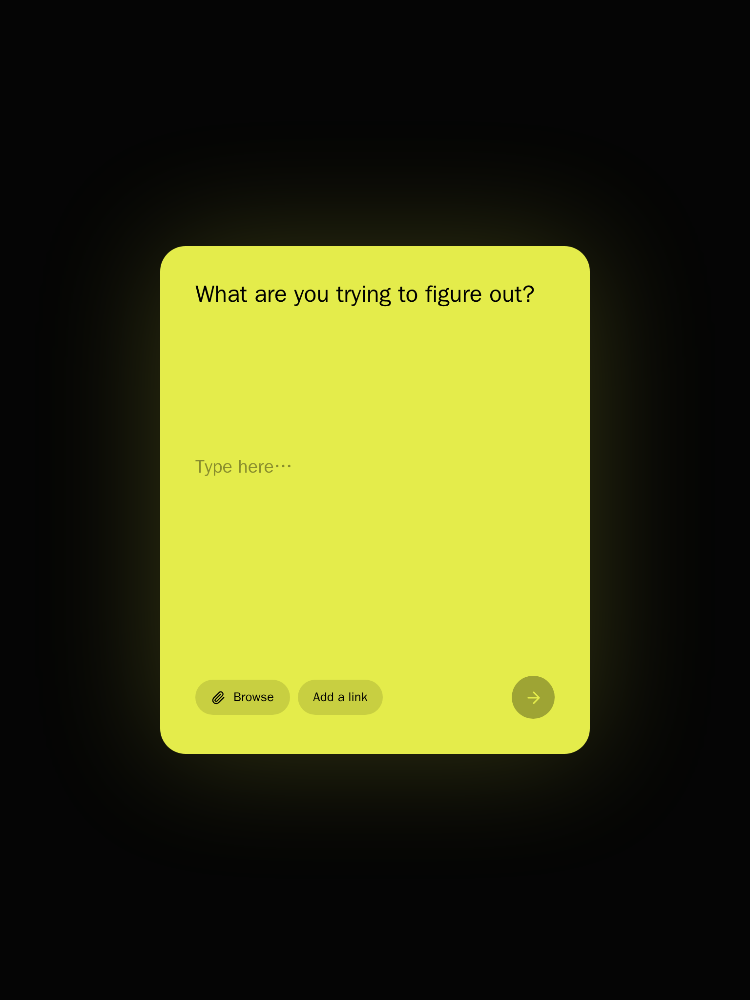
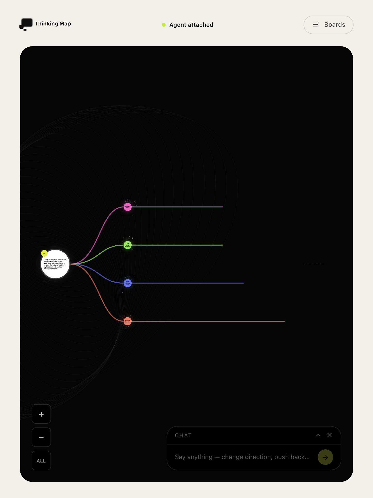
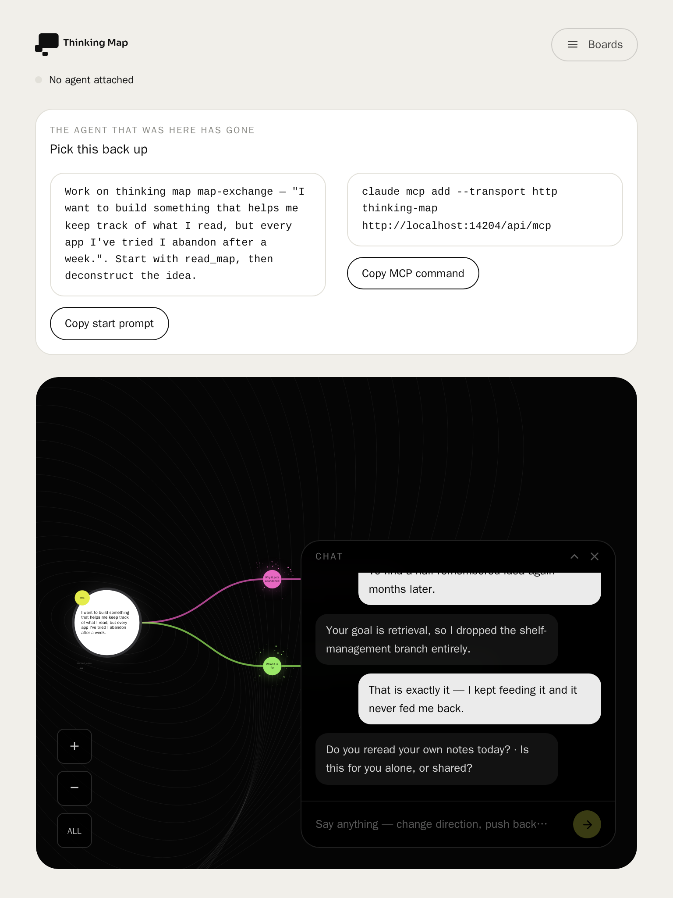
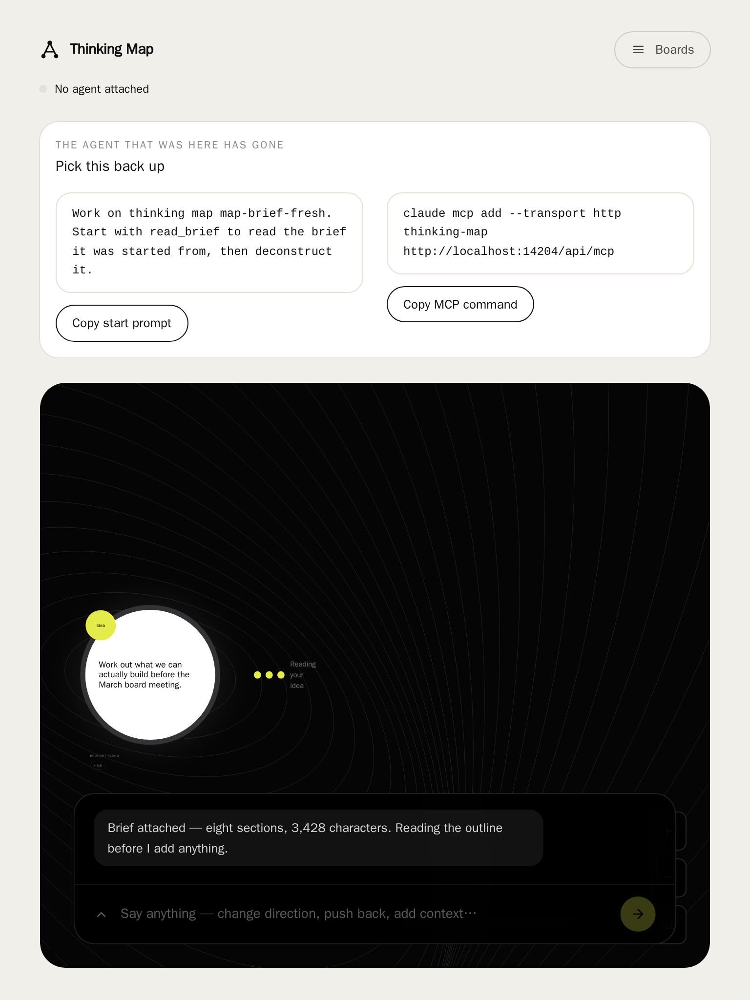
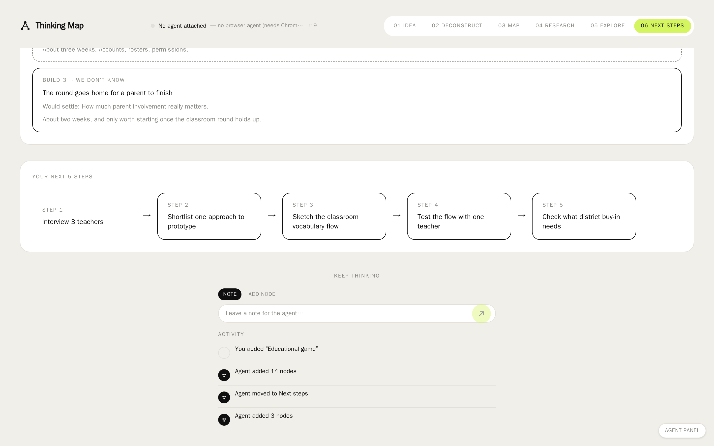
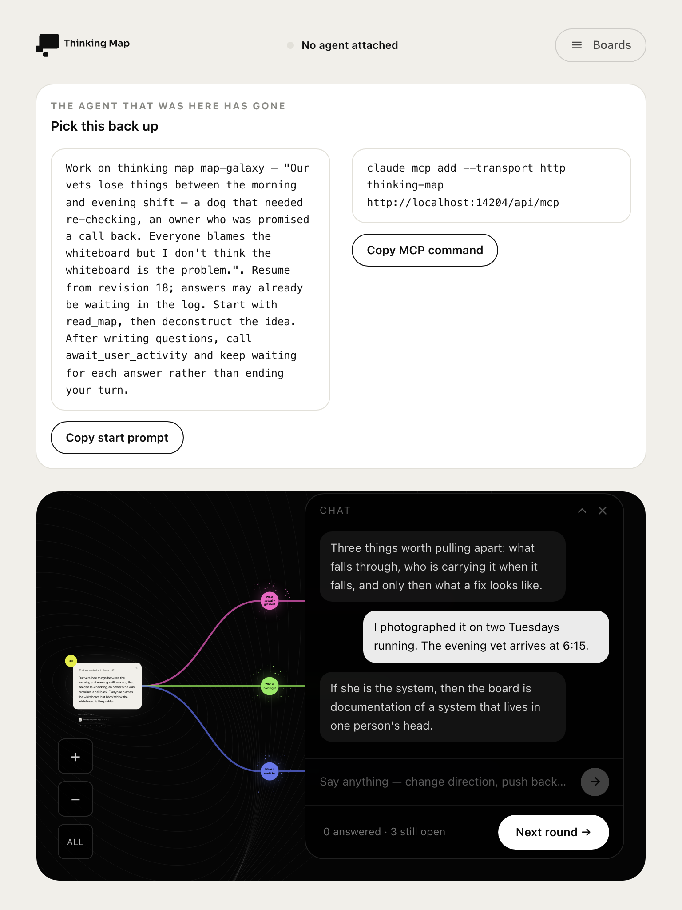
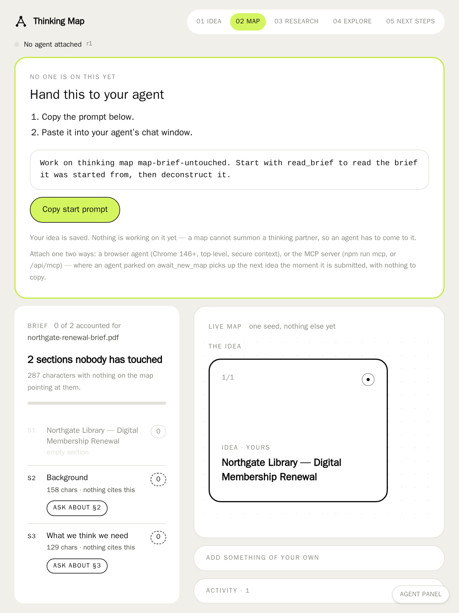
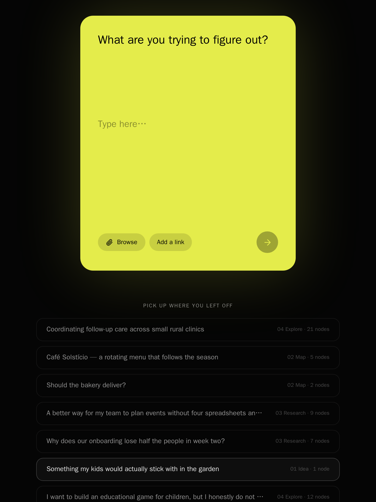
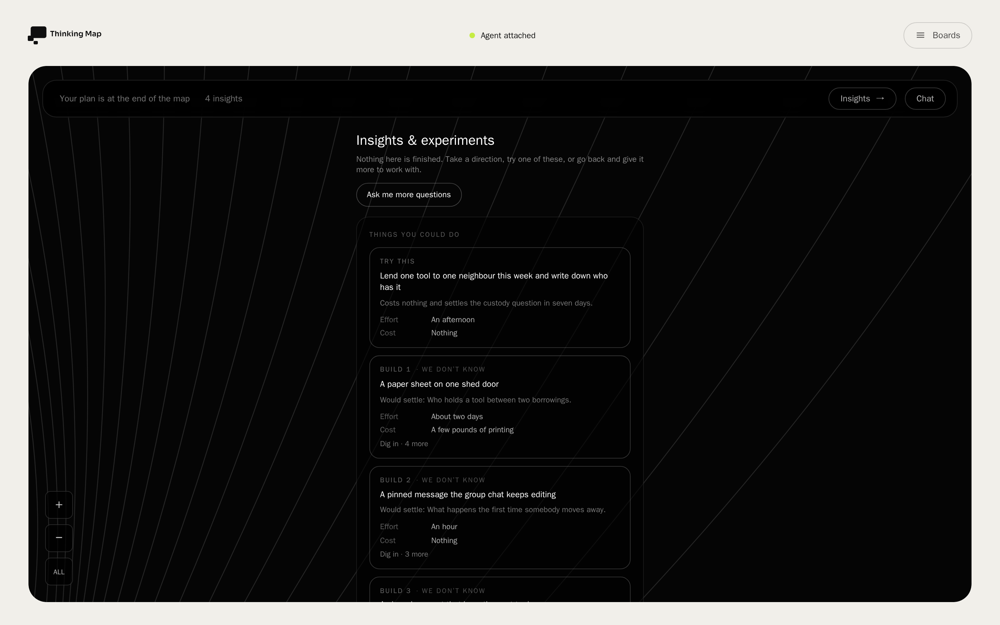
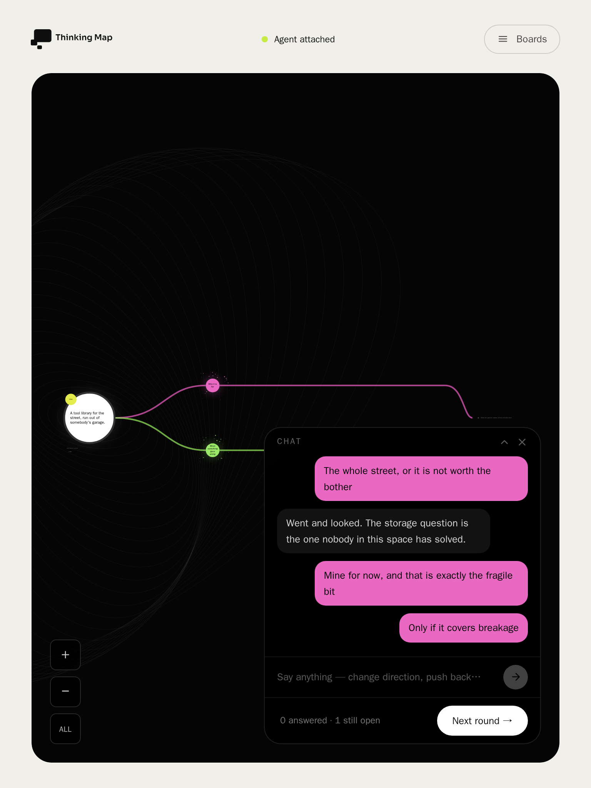

# Thinking Map

[](https://github.com/codeyam-ai/thinking-map/actions/workflows/ci.yml)
[](./LICENSE)

An AI thinking partner that helps you deconstruct a vague idea and turn your thinking
into a visual map and an actionable plan.

You arrive with something you cannot yet describe — *"I want to build an educational
game for kids, but I don't know what it should be"* — and instead of answering, the
partner asks the two or three questions that would change what you should build. Every
answer becomes a node on the map. You leave with what you know, what you don't, the
strongest directions, and the smallest thing worth building first.

The central principle: **don't just give me an answer — help me understand the problem
well enough to find a better answer.**

The map moves through five phases: **01 Idea → 02 Map → 03 Research → 04 Explore →
05 Next steps.**

## Run it locally

```bash
npm run setup   # install dependencies, provision PostgreSQL, push the schema, seed
npm run dev     # http://localhost:3000
```

Nothing has to be installed or hosted first. With no `DATABASE_URL` set, `setup` starts
a local PostgreSQL server of its own and writes the connection string to `.env.local`.
Set `DATABASE_URL` yourself and that database is used instead, untouched. See
[`DATABASE.md`](DATABASE.md).

No API key is needed. The app never calls a model itself — the agent is the one you
already have, and it brings its own credentials. See
[`AGENT_CONTRACT.md`](AGENT_CONTRACT.md) for the three ways an agent can attach.

<!-- codeyam:run-and-edit:start -->
## Develop this project with codeyam-editor

This project is built with [codeyam-editor](https://codeyam.com) — code and runnable data scenarios are authored side by side against a live preview.

```bash
# Clone the repo
git clone https://github.com/codeyam-ai/thinking-map && cd thinking-map

# Install codeyam-editor
npm install -g @codeyam-editor/codeyam-editor@latest

# Launch the editor (split-screen terminal + live preview)
codeyam-editor start
```
<!-- codeyam:run-and-edit:end -->

Every screen has runnable scenarios carrying their own seed data, so any state can be
viewed without touching real data:

```bash
codeyam-editor editor scenarios       # list every registered scenario
codeyam-editor editor refresh-tests   # run the test suite
npx tsc --noEmit                      # type-check
```

## What it looks like

Each of these is a registered scenario — a real state of the app, captured.

### The way in



One card, one free-text box. No structured fields. You can also attach a brief — browse
for a `.pdf` / `.docx` / `.md` / `.txt` / `.html`, or point at a page — and with one
attached the sentence becomes optional.

### The map mid-round



Your idea sits on the left. Each coloured branch is a theme the partner pulled out of
it, and the cards hanging off it are what it wants to know. A question and the node it
becomes are the same card — you answer inside the map rather than reading the question
in one place and answering it in another. The bar along the top always says what is
still waiting on you.

### One map, both hands on it



The partner writes to the map and so do you, and the map does not distinguish between
the two by putting them in separate places. An answered question and a node the agent
added sit on the same branch, because what matters is where a thought belongs, not who
had it.

### Arriving with a brief



A twenty-page spec is stored whole as the map's source. The partner reads it the way
anyone reads a long document — the outline first, then the passages that matter — so a
long brief cannot quietly fill the context that ought to be spent thinking about it.

### The plan you leave with



A plan is a build sequence, not a to-do list. Each increment names the assumption or
open question that building it would settle — and one that settles nothing is marked
**proves nothing yet** rather than sitting in the sequence looking like progress.

### What to do next


The end of the loop: what you know, what you don't, the directions worth taking, and
five concrete steps in order — plus the activity log of everything that happened to the
map, from both sides.

## Notes for anyone picking this up

- `package.json` runs `next dev --webpack`. Next 16 defaults to Turbopack, and
  Turbopack's dev output does not hydrate through the codeyam preview proxy. This is
  deliberate, not a leftover.
- A plain `npm run dev` does not serve `/isolated-components/*`, the fixture pages
  scenario captures render from — they would fill your dev session with convincing fake
  maps. Use `CODEYAM_APP_PORT=1 npm run dev` if you want them.
- Before adding a feature that touches auth, file uploads, email, or another external
  service, read [`FEATURE_PATTERNS.md`](FEATURE_PATTERNS.md).

## Contributing

Issues and pull requests are welcome. [`CONTRIBUTING.md`](CONTRIBUTING.md) covers
getting set up, the checks a change has to pass, and the few conventions here that
look like mistakes and are not. Everyone taking part is expected to uphold the
[Code of Conduct](CODE_OF_CONDUCT.md); to report a vulnerability, see
[`SECURITY.md`](SECURITY.md) rather than opening an issue.

## License

[MIT](./LICENSE) © 2026 CodeYam.

<!-- codeyam:scenario-gallery:start -->
## Scenario gallery

States captured as runnable scenarios with codeyam-editor:

### A board with pictures, a drawn shape and a shortlist



### A plan with a gap - one slice proves nothing


### A brief, and nobody has picked it up yet



### Complete - what to do next


### All eight, the list expanded



### Weighing the alternatives against each other



### An older question, three rounds up, still open



### Brief attached, nothing cited yet


<!-- codeyam:scenario-gallery:end -->
