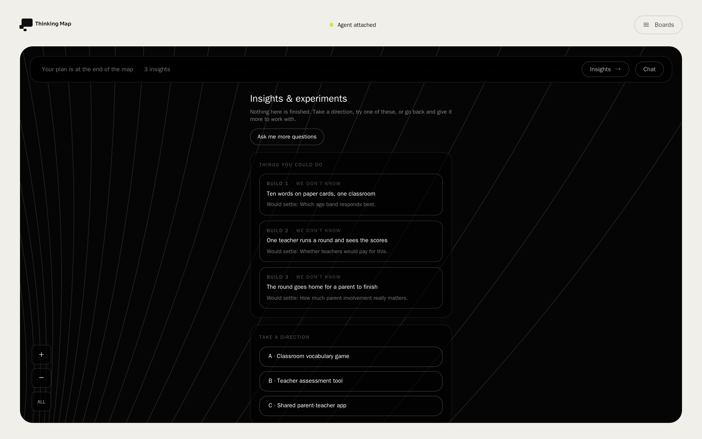
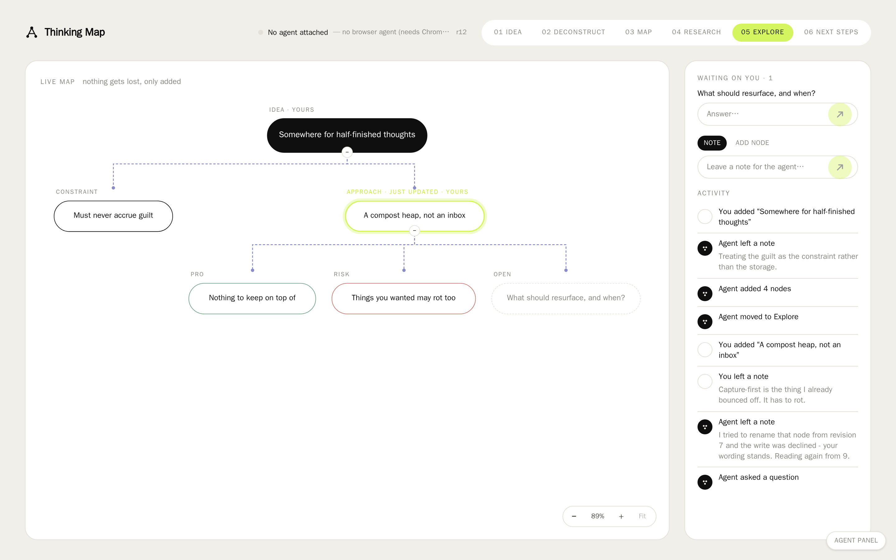
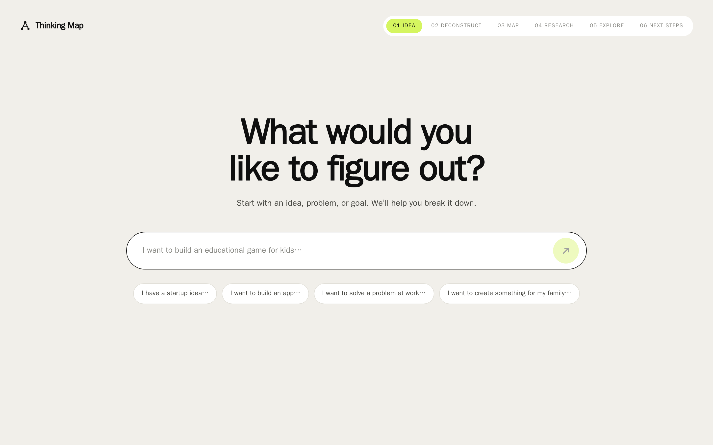
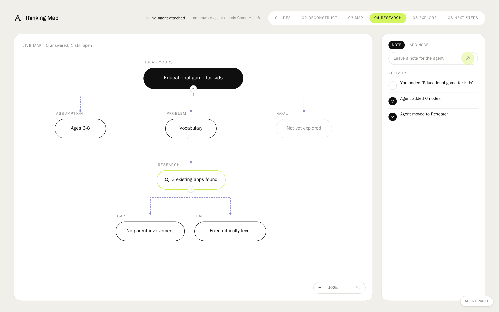
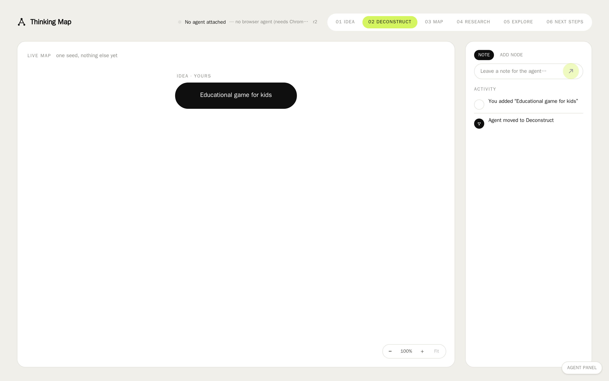
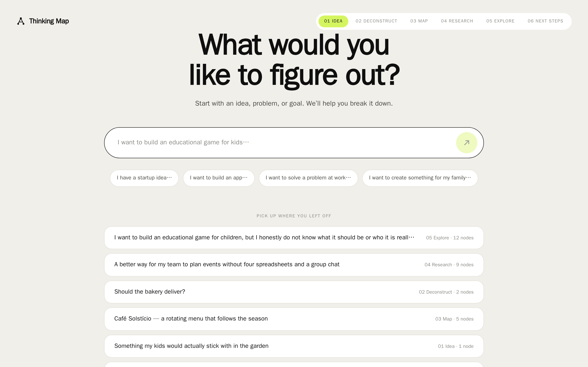
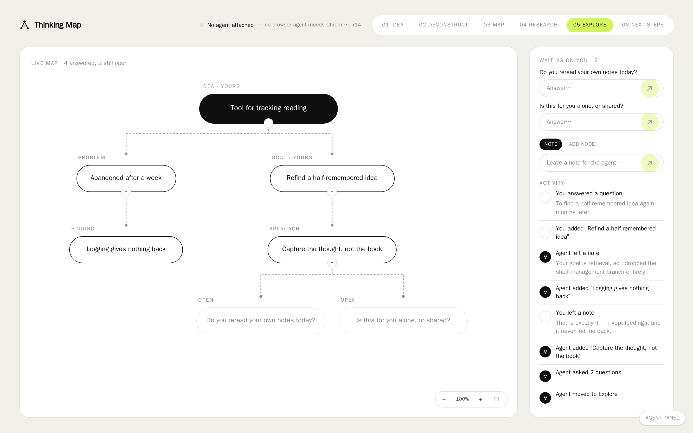
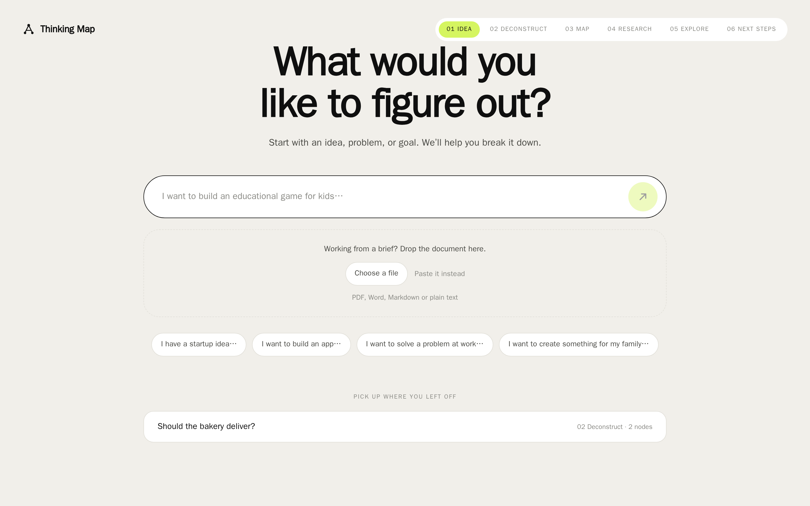

# Thinking Map

An AI thinking partner that helps you deconstruct a vague idea, explore the problem
space, and turn your thinking into a visual map and an actionable plan.

You arrive with something you cannot yet describe — *"I want to build an educational
game for kids, but I don't know what it should be"* — and instead of answering, the
partner names what it doesn't know and asks the two or three questions that would
change what you should build. Every answer becomes a node on a map. When it helps, it
searches the web for what already exists and hangs the findings, and the gaps in them,
off the map. Change direction and nothing is lost: the map updates and tells you what
changed. You leave with what you know, what you don't, the strongest directions, and
where to start tomorrow.

**The agent is your browser's agent, and the page is the shared artifact.** There is no
chat in this app. The thinking partner runs wherever you already talk to it and reaches
this page through its tools; the map is the thing you both write to. That is a
deliberate consequence of how WebMCP works rather than a missing feature — the page has
no access to the agent's conversation and under WebMCP never will, so it shows the half
it genuinely owns instead of faking the other.

The central principle: **don't just give me an answer — help me understand the problem
well enough to find a better answer.**

## The loop

| Phase | What happens |
| --- | --- |
| 01 Idea | You type something vague into one free-text input. No structured fields. |
| 02 Deconstruct | The partner asks a small number of high-value questions instead of answering. |
| 03 Map | Your answers become nodes: users, problems, goals, assumptions, open questions. |
| 04 Research | A live web search grounds the map in what already exists, and in the gaps. |
| 05 Explore | You change direction; the map adds and updates, and explains what changed. |
| 06 Next steps | What we know, what we don't, three directions, five concrete steps. |

## Setup

```bash
npm run setup   # install dependencies, create the SQLite database
npm run dev     # start the dev server on http://localhost:3000
```

The production database starts **empty** by design — you see the day-one state and
populate it by using the app. Each registered scenario carries its own seed data, so
every screen can be viewed in every state without touching production data.

No API key is needed. The app never calls a model itself — the agent is the one you
already have, and it brings its own credentials.

### What you can put into the map

The page's half of the exchange is a narrow column beside the map:

- **Waiting on you** — every open question the agent has asked, each with an answer
  field. Answering writes it to the log and releases the agent's turn if one is blocked
  on it; you never have to know which of those is happening.
- **Note** — a line for the agent to read on its next turn. It is not a chat message:
  the reply comes back in the agent's own surface, not here.
- **Add node** — put something on the map yourself, under any of the node kinds the
  agent's tools use. Nodes you wrote are badged *yours*, which is also what stops the
  agent re-ingesting its own writes.
- **Activity** — what has happened to the map, from both sides, oldest first.

### Handling the map

The map is directly manipulable, and each of the three answers a different problem:

- **Zoom and pan** — scroll or pinch over the map to zoom toward the pointer, drag empty
  canvas to pan, and press **Fit** to hand the viewport back. Auto-fit is how the map
  *opens*, not a standing rule: once you have set a scale it stays where you put it,
  including across the window resizes that would otherwise re-fit underneath you.
- **Nudge a node** — drag a pill somewhere more useful. What is stored is an *offset*
  from the node's computed position, not a coordinate, so the tidy tree stays
  authoritative: siblings still never overlap, parents still centre over their children,
  and a node the agent adds tomorrow still places itself sensibly instead of landing on
  something you moved last week. Offsets persist, so an arrangement survives a reload.
- **Fold a branch** — click the control on a parent's bottom edge to collapse it; it
  reports how many nodes it is holding. Folding removes the subtree from the layout
  rather than hiding it after the fact, so the remaining tree genuinely re-tidies and
  gets narrower — which is what rescues a map that has outgrown its panel.

Two deliberate limits. Folding is per-viewer and unpersisted: it is a reading posture,
not a property of the map, and an agent has no business seeing a subtree disappear.
And moving a node is not an exchange event — the activity rail records what the two
sides *thought*, so a move does not appear there and does not bump the map's revision,
which means a second viewer picks it up on their next load rather than immediately.

### Driving it without an agent

WebMCP binds only in a top-level secure page in a browser with an agent (Chrome 146+),
so no agent can attach inside an iframe — which is every preview and every captured
scenario. Outside production the page therefore carries an **Agent panel** (bottom
right). It calls `window.__thinkingMapAgent`, the same bound catalog a real agent uses,
so its "run the demo sequence" button exercises the genuine tool paths rather than a
mock of them.

## Three front doors

The map is a shared artifact, not a chat log. An agent can reach it three ways, and all
three run the same tool catalog (`app/lib/toolCatalog.ts` declares the tools;
`app/lib/toolRuntime.ts` implements them once), so no door can drift from the others.

The shared tools are `read_map`, `add_nodes`, `update_node`, `set_phase`, `post_note`,
`ask_user`, and `await_user_activity`. `list_thinking_maps` and `create_thinking_map`
are server-door-only — a page is already on one map.

**In the page (WebMCP).** The agent lives in the browser and the page publishes its
tools to it. This needs Chrome 146+ (`navigator.modelContext`), HTTPS or localhost, and
the top-level frame — WebMCP is unavailable inside an iframe, deliberately. When any of
that is missing the page says so rather than pretending to be connected.

**Over HTTP** — `POST /api/mcp` (streamable HTTP; send
`Accept: application/json, text/event-stream`).

**Over stdio**, for clients that launch the server as a child process:

```bash
npm run mcp
```

To register it with Claude Desktop, add to its MCP config:

```json
{
  "mcpServers": {
    "thinking-map": {
      "command": "npm",
      "args": ["run", "mcp"],
      "cwd": "/absolute/path/to/this/project"
    }
  }
}
```

### WebMCP is pull-only — the contract an agent should follow

A page cannot wake an agent. There is no push channel, and the person editing the map is
under no obligation to wait for anyone. So the exchange is a durable, ordered record
rather than a live connection: every map carries a monotonic `revision`, and every change
— yours or theirs — is one append-only event tagged with who made it.

Three habits follow from that, and the tools are shaped to make them easy:

- **Read with a cursor.** `read_map { sinceRevision }` returns only what happened after
  that revision, so you never re-ingest your own writes as new information.
- **Write with a `requestId`.** `add_nodes` and `update_node` take one, and a retry
  carrying the same value returns the original revision instead of writing twice.
- **Wait with `await_user_activity`,** not a polling loop. It blocks until the person
  actually does something.

Two more things worth knowing:

- **Conflicts come back as results, not errors.** Pass `expectedRevision` to
  `update_node`; if the person changed that node since you read it, the write is declined
  and both versions are described back to you. Nothing is overwritten.
- **Every wait is bounded and resumable.** `ask_user` and `await_user_activity` take a
  timeout and, on expiry, hand back a cursor rather than hanging. Giving up costs
  nothing: the question stays on the map and the answer lands in the log for your next
  read.

### Driving the tools without a browser agent

WebMCP needs a top-level secure context, so it is genuinely absent in previews and
captured scenarios. The page therefore always publishes a headless driver over the same
bound catalog:

```js
await window.__thinkingMapAgent.callTool('read_map', {});
await window.__thinkingMapAgent.callTool('post_note', { text: 'what I changed and why' });
```

The page-side binding forwards each call to `POST /api/maps/:id/tools`, which runs the
same implementation the other two doors use. `GET|POST /api/maps/:id/exchange` is the
log itself — read it with `?since=`, and post a `user.answer`, `user.note`, or
`user.node` as the person.

## How it's built

- **Next.js + Prisma + SQLite.** Four tables: `ThinkingMap`, `Message`, `MapNode`, and
  `MapEvent`. The map is a tree via a nullable `parentId`, so there is no separate edge
  table. `Message` is now history only — nothing renders it, and new thinking is
  recorded as `MapEvent`.
- **`app/lib/exchange.ts`** is the only place map revisions are minted. One append-only
  log answers all three forms of "what happened after revision N?" — the agent's delta,
  the unread user contributions, and the activity feed — and it is the only thing that
  can record a deletion, which a diff over `MapNode` rows cannot see.
- **`app/lib/mapStore.ts`** is the only place that reads or writes a map; every front
  door goes through it, and each write also becomes an event on the log.
- **`app/lib/contributions.ts`** turns a contribution from the page into what it
  actually does to the map — a node that has to appear, a question that has to stop
  being open — server-side, so every front door sees it rather than only the browser
  that did it.
- **`app/lib/exchangeRail.ts`** is how the log reads to a person, and
  `app/lib/exchangeFormat.ts` how it reads to an agent. They are separate on purpose:
  an agent needs the revision cursor on every line, a person needs to know what happened
  to their map.
- **The map's geometry** is `app/lib/mapLayout.ts` — a tidy-tree layout returning
  absolute pixel positions, tested for sibling non-overlap, parent centring, orphaned
  parents, and cycle termination.

### Two notes for anyone picking this up

`package.json` runs `next dev --webpack`. Next 16 defaults to Turbopack, and Turbopack's
dev output does not hydrate through the codeyam preview proxy — no client component
becomes interactive. This is deliberate, not a leftover.

Navigation anchors carry `suppressHydrationWarning`. The preview proxy rewrites
`href="/"` to `href="/__codeyam_preview/"` in the served HTML while React's payload
still says `/`. The rewrite is correct and wanted; only the warning needed silencing.

## Development

```bash
npx tsc --noEmit                        # type-check
codeyam-editor editor refresh-tests     # run the test suite
codeyam-editor editor scenarios         # list every registered scenario
```

Before adding a feature that touches auth, file uploads, email, or another
external service, read [`FEATURE_PATTERNS.md`](FEATURE_PATTERNS.md) — it sets out
the local-first approach this stack expects and the upgrade path for each.
[`DATABASE.md`](DATABASE.md) covers schema changes and where credentials belong.

Built with [CodeYam](https://codeyam.com) — `codeyam editor` to launch the editor.

<!-- codeyam:run-and-edit:start -->
## Develop this project with codeyam-editor

This project is built with [codeyam-editor](https://codeyam.com) — code and runnable data scenarios are authored side by side against a live preview.

```bash
# Clone the repo
git clone https://github.com/codeyam-ai/thinking-map && cd thinking-map

# Install codeyam-editor
npm install -g @codeyam-editor/codeyam-editor@latest

# Launch the editor (split-screen terminal + live preview)
codeyam-editor start
```
<!-- codeyam:run-and-edit:end -->

<!-- codeyam:scenario-gallery:start -->
## Scenario gallery

States captured as runnable scenarios with codeyam-editor:

### Complete - what to do next



### Conflict declined - the person rewording survived



### Day one - nothing yet



### Grounded - research and its gaps



### Just started



### Many saved maps



### Mid-exchange - agent and human on one map



### One saved map


<!-- codeyam:scenario-gallery:end -->
